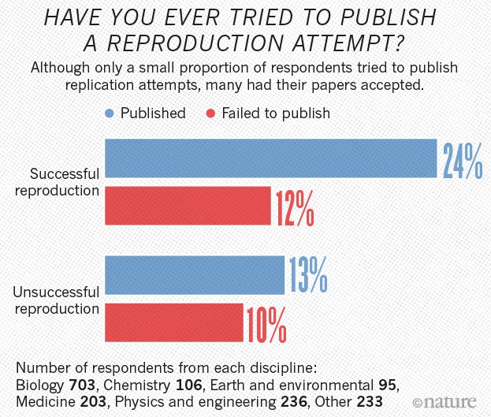
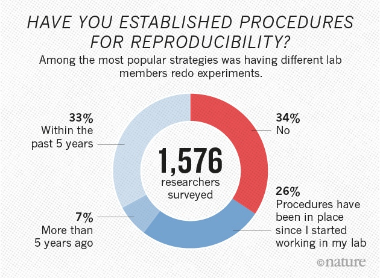

```{r setup, include=FALSE}
options(htmltools.dir.version = FALSE)
```

```{r xaringan-themer, include = FALSE}
library(xaringanthemer)
duo_accent(
  primary_color = "#A70000",
  secondary_color = "#ff0000",
  white_color = "white",
  
  header_font_google = google_font("Roboto Condensed"),
  text_font_google   = google_font("Roboto Condensed", "300", "300i"),
  code_font_google   = google_font("Ubuntu Mono"), text_font_size = "30px"
)
```

## apresentação

+ __Andrea Sánchez-Tapia__ Bióloga (UNAL - Colômbia), MSc. Ecologia (UFRJ), Dra. em Botânica (ENBT-JBRJ). Usuária de R desde 2009. Ecologia quantitativa, informática da biodiversidade, ENM/SDM
--

+ __Sara Ribeiro Mortara__
Bióloga (ESALQ/USP), MSc. Ecologia e Conservação da Biodiversidade (UESC) e Dra. em Ecologia (USP). Usuária de R desde 2009. Modelagem estatística
--

+ __Diogo Souza Bezerra Rocha__ 
Biólogo com ênfase em Ecologia, MSc. em Botânica. Dr. em Ecologia e Conservação da Biodiversidade (UESC). R e Sistemas de Informação Geográfica (SIG)

---
class: center

#### Núcleo de Computação Científica e Geoprocessamento IP-JBRJ <br> Dra. Marinez Ferreira de Siqueira

--

```{r, echo = F, out.width=300}
knitr::include_graphics("figs/modleR.png")
```

https://github.com/Model-R/modleR


---
## objetivos da disciplina

1. estrutura básica de um __projeto__ de análise de dados

--

4. __ferramentas__ para criar __fluxos de trabalho__ organizados e reprodutíveis 

--

1. __git__ como sistema de controle de versões

--

2. gestão, armazenamento e limpeza de dados

--

3. __relatórios reprodutíveis__ usando rmarkdown, gestores de bibliografia e R 

<!-- 1. Introdução à ciência aberta -->
<!-- 1. Organização dos projetos de análise -->
<!-- 2. Organização, formatação e limpeza de dados  -->
<!-- 3. Análise exploratória de dados -->
<!-- 4. Gráficos  -->
<!-- 5. Relatórios reproduzíveis em `R` -->
<!-- 5. `R` para biólogos, taxônomos e ecólogos -->
---
## estrutura do curso

<small>
```{r, echo = F}
library(kableExtra)
week <- data.frame(
  seg = c("ciência aberta & reprodutibilidade", "", "estrutura de projetos de análise de dados"),
  ter = c("controle de versões usando git","", "gestão e manipulação de dados em bases relacionais"),
  qua = c("relatórios reprodutíveis usando Rmarkdown", "",  "análise exploratória de dados"),
  qui = c("documentos reprodutíveis e gestores de bibliografia", "", "gráficos reprodutíveis em R"),
  sex = c("mapas reprodutíveis em R", "",
          "tira dúvidas/ dicas para fluxos de trabalho reprodutíveis"))
kableExtra::kable(week, padding = 0)
```

</small>

---
class: center, middle
# O que é __ciência aberta__ (e por que pensar nela curso sobre análise de dados em `R`)?

---
## a gente 

+ Desenha experimentos
+ Levanta dados
+ Analisa dados
+ Discute, escreve, submete, publica manuscritos
+ Recebe verba de projetos, lida com recursos públicos
+ Faz revisão de manuscritos
+ Orienta, forma outros cientistas, colabora
+ Faz extensão e divulgação científica
+ Tem a responsabilidade de publicar e divulgar os resultados de nossa pesquisa

---
class: middle, center 

## Nossa forma de trabalhar pode ajudar a dar conta de todas as demandas, ou ser um empecilho para estas atividades: __boas práticas__
## A ciência aberta pode ser um marco para pensar alguns temas relativos a estas boas práticas

---
## o que é ciência aberta?

Um conjunto de práticas que busca que todos os produtos da pesquisa científica sejam disponíveis publicamente __desde os dados originais até a publicação, incluindo a metodologia.__

Dados e conteúdo aberto poderiam ser __usados__, __modificados__, __compartilhados__ livremente por qualquer pessoa, para qualquer propósito

---
## por que ciência aberta?

+ __transparência__,  __qualidade__, __reprodutibilidade__
--

+ resultados mais robustos, disponíveis para revisão, correção por parte de pares e de qualquer cidadão.
--

+ __colaboração__, reanálise, replicação de resultados
--

+ retorno do investimento em atividades científicas à sociedade

---
## seis princípios da ciência aberta

1. __Dados__ abertos
--

1. __Ferramentas__ "_open source_" - não apenas gratuitas, mas de código aberto.
--

1. __Metodologia aberta__, compartilhando os detalhes e as ferramentas para garantir transparência e reprodutibilidade
--

1. __Acesso__ aberto para a publicação dos resultados
--

1. __Revisão__ (_peer review_) aberta
--

1. __Fontes de educação__ abertas


---
class: middle, center

## __Dados abertos__
## Aquisição e manejo/manutenção de dados científicos

---
## o que constitui um dado científico?

--

+ os dados _crus_ (medições, gravações, imagens, arquivos)
--

+ os __protocolos experimentais__ (planos, procedimentos, calibração de instrumentos)
--

+ procedimentos de __limpeza__, __processamento__, e __análise__ de dados
--

+ os dados _processados_


---
## registro de dados e metadados

+ no campo, no lab, no herbário
+ caderno de laboratório/de campo deve ser um registro __permanente__, __bem organizado__, __compreensível__, __completo__, que permita a replicação por outros
+ os cadernos de laboratório devem ficar em algum lugar seguro

---

## manutenção e compartilhamento

+ __digitalização__ correta?
+ _backups_ locais, repositórios na web, repositórios das instituções
+ associados às publicações (e.g. Dryad, https://www.datadryad.org/)
+ deve ser __no longo prazo__ -> `DOI`

<!-- Os dados devem poder ser __compartilhados__: para correção, repetição, replicação, reprodução, reanálise dos experimentos e para colaboração em novos trabalhos. -->

---
## quem é responsável pela __integridade__ dos dados?
____Qualquer indivíduo envolvido no desenvolvimento e execução da pesquisa e procesamento dos dados____

+ Os estudantes
+ O pesquisador principal
+ O orientador
+ Os assistentes de laboratório
+ Os assistentes de campo que realizaram as medições e/ou ficaram nas planilhas etc. 

---
## o que é um dado sem um metadado?

metadados: dados sobre os dados.
O __que__, __onde__, __como__, __quando__, __quem__, e __por que__


+ Os __métodos__ e a __lógica__ por trás de seu tratamento <!--detalhes sobre o processamento dos dados brutos -->
+ __Materiais utilizados__ 
+ Localização da coleta
+ Observações adicionais
+ Notas suplementares
+ Marcação adequada das amostras e identificação de todos os dados

---
background-image: url(figs/rda.png)
background-position: 80% 80%

## critérios para avaliar se os dados são abertos: FAIR


+ Research Data Alliance https://www.rd-alliance.org/ 
+ FAIR data:
    + __F__indable
    + __A__ccessible
    + __I__nteroperative
    + __R__eusable
---
## encontráveis (F):
+ __identificador global único e persistente__ (DOI, ORCID) 
+ descritos com __metadados__ abundantes
+ __registrados ou indexados__ em alguma plataforma com serviço de busca

---

## acessíveis (A):

+ __protocolo padrão de comunicação__, aberto, gratuito, e implementável universalmente
+ autenticação e autorização - __segurança__ para as partes envolvidas
+ metadados acessíveis inclusive quando o dado não está mais disponível

---
## interoperáveis (I)

+ __linguagem__ formal, acessível, compartilhada, aplicável amplamente
+ __vocabulário__ que segue os princípios FAIR
+ __referências qualificadas__ a outros (meta)dados

---

## re-utilizáveis (R)

+ atributos __precisos__ e __relevantes.__ 
+ __licença__ clara e acessível
+ associados com sua __proveniência__
+ __protocolos padrão da comunidade__ (ex. ecologia, genética).

#### Há __protocolos padrão__ dependendo da disciplina (DarwinCore, EML - Ecological Metadata Language)

---
class: middle


---
class: center, middle

## __Ferramentas abertas *Open source*__

---
## software _libre_


+ gratuito e de código aberto
--

+ deve poder ser: __usado__, __copiado__, __estudado__, __modificado__, __redistribuído__
--

+ __sem restrição__
--

+ __sem discriminação de qualquer tipo__ a grupos de pessoas ou campos de ação
--

+ mantendo a __licença__ original

---
## software _libre_

+ `R`, Python
+ Firefox
+ Android
+ Linux: sistema operativo
+ QGIS para SIG
+ LibreOffice para processamento de texto, folhas de cálculo, desenhos, apresentações, manuscritos
+ __Zotero__ para gerenciar a bibliografia
+ __git__ para controlar as versões de seus projetos
+ ImageJ e GIMP para processar imagens

---
class: middle, center

# Dá para subtituir todos os passos de seu fluxo de trabalho por software de código aberto? 


---
class: center, middle
# __Metodologia aberta__

---

## metodologia aberta

+ registro, processamento e análise
+ cada passo de análise deve ser exposto
+ cada publicação deve conter toda a informação necessária para que
    + o leitor entenda exatamente o que foi feito (confiança e robusteza) 
    + outros cientistas possam repetir o trabalho pós-publicação
+ isto inclui __a lista completa de referências__ usadas para realizar a pesquisa.
+ ligado intimamente ao registro adequado de metadados

---
## replicação e reprodutibilidade

[Nature](https://www.nature.com/news/1-500-scientists-lift-the-lid-on-reproducibility-1.19970) perguntou a 1500 cientistas se eles acham que há uma crise de reprodutibilidade

.pull-left[
```{r, echo = F, out.width=320}
knitr::include_graphics("figs/reproducibility-graphic-online1.jpeg")
```
]
--

.pull-right[
```{r, echo = F, out.width=320}
knitr::include_graphics("figs/reproducibility-graphic-online3a.png")
```
]


---
class: middle

.pull-left[
```{r, echo = F, out.width=350}
knitr::include_graphics("figs/reproducibility-graphic-online4.jpg")
```
]

--

.pull-right[

```{r, echo = F, out.width=350}

```


+ há más práticas e pressão por publicação de resultados novos e positivos (vieses)
+ falta transparência nos dados e no código
]

---
## algumas regras básicas 

+ não usar programas para gerar gráficos de uma maneira que modifique os resultados
--

+ não modificar o método de análise para obter os resultados desejados
--

+ não omitir dados que não suportam suas conclusões
--

+ não fabricar dados e reportar dados falsos como reais
--

+ não modificar deliberadamente os dados
--

+ não reportar os mesmos dados em publicações diferentes (_"salami science"_)

---
.pull-left[
```{r, echo = F, out.width=350}
knitr::include_graphics("figs/reproducibility-graphic-online5.jpg")
```
]
--

.pull-right[

```{r, echo = F, out.width=350}

```

+ __métodos__ e __desenho experimental__
+ __orientação__ e __ensino__
+ controle de qualidade de dados e código
+ melhores incentivos pelo "sistema"
]
--

__mas nem todo mundo está tomando decisões a respeito... __ 

---
## passos para uma metodologia aberta

+ priorizar ferramentas baseadas em _scripts_ como `R` ou python
--

+ usar sistemas de __controle de versões__ como `git`
--

+ documentar todos os passos da metodologia
--

+ publicar os protocolos e o código
--

+ fomentar a revisão da metodologia e do código entre pares

---
class: middle, center

# resolve todos os problemas? não (mas é um bom primeiro passo)

---
## ferramentas abertas ou metodologias abertas?

+ ferramenta e metodologia abertas? __ideal__ 
--

+ ferramenta aberta e metodologia "fechada"? _não adianta!_
--

+ ferramenta proprietária e metodologia aberta? __pode ser__
--

+ ambas fechadas `:'(` 
--

### __não adianta usar ferramentas abertas se a metodologia em si não é reproduzível__
### __dá para criar metodologias reproduzíveis usando software proprietário__

---
class: center, middle

# __A publicação em revistas de acesso aberto__


---
background-image: url(https://upload.wikimedia.org/wikipedia/commons/thumb/7/77/Open_Access_logo_PLoS_transparent.svg/142px-Open_Access_logo_PLoS_transparent.svg.png)
background-size: 20%
background-position: 80% 20%

## revistas de acesso aberto

1. __Diamante__ disponível gratuitamente na internet e sem cobrar dos autores

--

1. __Dourado__ disponível gratuitamente na internet, cobrando uma taxa aos autores

--

1. __Verde__ permite que os autores depositem versões próprias em repositórios. 

--

1. __Híbrido__ mistura de manuscritos abertos e não abertos

--

#### Atenção com __revistas predatórias__!


---
## novos modos de publicação

1. o manuscrito clássico, escrito em _word_, sem código

--

4. revistas que aceitam a submissão de _pre-prints_ <!--, versões previamente publicadas na internet porém sem revisão por pares -->

--

3. revistas que pedem que os dados estejam acessíveis em algum repositório (Dryad)

--

5. revistas que aceitam -> pedem o código utilizado para as análises

--

6. revistas que recebem __manuscritos reprodutíveis__

--

7. revistas com revisão (_peer-review_) aberta (__O quinto princípio da ciência aberta!__)


---
class: middle, center

### Os cinco primeiros princípios da ciência aberta passam pela necessidade de transparência e responsabilidade nas metodologias.

### O sexto princípio da ciência aberta diz respeito à criação e divulgação de material educativo aberto e disponível para todos independentemente da origem condição social e econômica

---
class: center, middle
 
## Precisamos refletir sobre nosso fluxo de trabalho... 
e sobre nossa responsabilidade ao fazer ciência

---
### ferramentas e fluxos de trabalho

+ Como é seu fluxo de trabalho hoje?
--

+ Ele se beneficiaria de alguma mudança em termos destes princípios?
--

+ Quem é responsável pela integridade de seus dados?
--

+ Como seus dados estão sendo registrados? Como e onde estão sendo guardados?
--

+ Você tem colaborações a partir de seus dados? Poderia compartilhar os dados no estado em que eles estão hoje?
--

+ Usa formatos abertos? O software é proprietário? 
--

+ Há contextos nos quais você não deva compartilhar os dados?
  
---
## ferramentas e fluxos de trabalho

+ Como você analisa os dados?
--

+ São metodologias bem documentadas?
--

+ Quando usa metodologias de "apontar e clicar", você documenta todos os passos?
--

+ Como você garante que a última versão de seus dados e código/metodologia é a correta?
--

+ Como você escreve sua dissertação/tese e seus manuscritos?
--

+ Você usa software pago ou proprietário? Usa software "pirata"?

---
## nesta disciplina 

+ Tentar manter a integridade do dado primário

--

+ Manter uma distinção entre o dado bruto e o dado processado, e um __registro permanente__ dos passos de limpeza e processamento 

--

+ Manter a metodologia aberta

--

+ Aprender sobre __controle de versões__ 

--

+ Aprender sobre relatórios e manuscritos reproduzíveis

---

## referências

+  Gorgolewski KJ, Poldrack RA (2016) A Practical Guide for Improving Transparency and Reproducibility in Neuroimaging Research. PLoS Biol 14(7): e1002506. https://doi.org/10.1371/journal.pbio.1002506
+ Kraker, P., Leony, D., Reinhardt, W., & Beham, G. (2011). The Case for an Open Science in Technology Enhanced Learning. International Journal of Technology Enhanced Learning, 6(3), 643–654  
+ http://opendefinition.org/od/2.1/en/  
+ https://nikokriegeskorte.org/2016/02/15/the-four-pillars-of-open-science/
+ Open Science Framework https://osf.io/

---

## referências
+ Blog OpenScience.com https://openscience.com/
+ NIH - Instruction in Responsible Conduct of Research https://oir.nih.gov/sourcebook/ethical-conduct/responsible-conduct-research-training/
+ Zook, Matthew, et al. “Ten Simple Rules for Responsible Big Data Research”. PLOS Computational Biology, vol. 13, núm. 3, marzo de 2017, p. e1005399. PLoS Journals, doi:10.1371/journal.pcbi.1005399.
