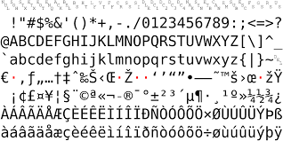
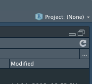
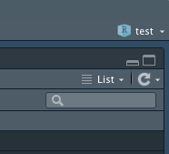

```{r setup, include=FALSE}
options(htmltools.dir.version = FALSE)
```

```{r xaringan-themer, include = FALSE}
library(xaringanthemer)
duo_accent(
  primary_color = "#A70000",
  secondary_color = "#ff0000",
  white_color = "white",
  
  header_font_google = google_font("Roboto Condensed"),
  text_font_google   = google_font("Roboto Condensed", "300", "300i"),
  code_font_google   = google_font("Ubuntu Mono"), text_font_size = "30px"
)
```


<!-- falar de `R`
introduzir rstudio
falar da console, do script, do _workspace_ e do diretorio de trabalho,
falar de caminhos relativos,
falar do help,
do help das funcoes, 
de ajuda online,
falar de boas praticas de trabalho em `R`: 
-->


+ uma **linguagem** de programação estatística criada em 1991 a partir de S e S-PLUS
--

+ **software _libre_**: gratuito e livre de ser usado e modificado para qualquer fim
--

+ __cross-platform__: pode ser usado em qualquer sistema operacional
--

+ programação baseada em _scripts_
---

## vantagens de usar `R`

+ __robusteza e transparência__: o código é escrito pelos especialistas mas pode ser examinado
--

+ __suporte não oficial__: uma comunidade ativa trabalhando nas mesmas perguntas que você
--

+ __interdisciplinário e extensível__ (listas de emails, stack overflow, rstudio community)
--

+ __flexibilidade__: o usuário pode virar programador
--

+ __integração__ com outras ferramentas
--

+ ótima __capacidade gráfica__!
--

#### filosofia: Um ambiente interativo, que facilite a transição de usuário para programador

---

## `R` tem uma estrutura modular

+ os pacotes de base são desenvolvidos e mantidos pelo __`R` Core Development Team__
--

+ repositório oficial: __CRAN__ (The Comprehensive `R` Archive Network: http://cran.r-project.org/)
--

+ outras fontes de pacotes: Bioconductor, github,  **rOpenSci.org**, páginas pessoais etc. 

---
background-image: url(figs/cran.png)
background-size: 90%
background-position: 50% 90%

## CRAN https://cran.r-project.org/

+ rede de servidores ftp e _web servers_ com versões __idênticas__ e __atualizadas__ do código e documentação para `R`
+ usar o espelho (_mirror_) de CRAN mais próximo para minimizar a carga da rede:  __Fiocruz__

---
background-image: url(figs/bioconductor.png)
background-size: 100%

---
background-image: url(figs/github-pkg.png)
background-size: 100%
background-position: 50% 80%

## github

---
background-image: url(figs/github-pkg2.png)

---
## instalar, carregar, citar pacotes


```{r, eval =F}
install.packages("vegan")
```

```{r, eval =F}
library("vegan")
citation("vegan")
```

---
## onde rodar `R`?

+ `R` pode ser rodado desde qualquer __terminal__ de windows, mac, linux
--

+ A interface original de `R` é um console onde o código é escrito
--

+ Na versão para windows e mac tem um editor de texto incorporado e algumas opções (`R`-GUI)
--

+ Algumas interfaces gráficas e ajudas para executar:
  + Modo ESS do Emacs
  + RStudio
--

## RStudio não é `R` e não está fazendo as análises

---
background-image:url("figs/00_rstudio.png")
background-size: 90%


---
background-image:url("figs/00_rstudio.png")
background-size: 90%


.pull-left[
### script
]

.pull-right[
### __*workspace*__
]

.footnote[
### console (`R` vive aqui) 
]
]

 <!-- abrir, 
 Arquivo > Novo arquivo > `R` script
4 esquinas, o script, a console, algumas abas que iremos explorando 1. foco en el script
getwd() control enter, algo similar a esto debe aparecer
 dà para escribir lo mismo en la console pero no va a quedar guardado. 
 el script puede ser salvado. 
 la hitoria va a registrar ambas cosas
 a maior parte do trabalho vai ser aqui e quando tiver um plot vai na aba de plots, quando tiver algum objeto no ambiente, ele vai ser listado no ambiente
 --> 

---
## uma sessão de trabalho em `R`

+ usar o _script_ para mandar instruções ao __console__
--

+ criar objetos ou ler os dados do HD para "dentro" da sessão (o __*workspace*__)
--

+ trabalhar com os objetos do __*workspace*__, executando funções dos __pacotes__ 
--

+ salvar o resultado no HD de volta
--

.pull-right[

         Tudo o que existe são __objetos.__  
         Tudo o que acontece são chamadas a __funções__  
                         Chambers, 2014  
]
 
---
## o script

+ arquivo de texto com extensão __.R__
--

+ permite recriar todas as análises `->` __reprodutibilidade__
--

+ unidade de busca e troca entre pesquisadores e está sendo anexada a publicações científicas 


---
## o _workspace_ 
--

+ __objetos__ são armazenados na memória RAM (temporariamente) no ___workspace___ da sessão.
--

+ o operador __`<-`__ cria o objeto (assigna o nome)
--

+ muitas formas de ler diferentes tipos de dado, funções como `read.table()` ou `read.csv()`
--

+ muitas formas de salvar os resultados:
`write.table()` ou `write.csv()` para tabelas, `write.png()` e similares para imagens, etc.

---
## sobre o _workspace_...

+ `R` pode salvar o _workspace_ (.RData) e restabelecê-lo entre sessões
--

+ mas __só porque você pode fazer algo não quer dizer que você _deva_ fazê-lo__
--

<center>
```{r, echo = F, out.width=250}

```

--
.footnote[
__não salve o _workspace___
]
</center>

---
## sobre o _workspace_...

+ não é confiável, pode conter objetos criados em diferentes momentos e com erro.

--

+ uso de memória RAM

--

+ salvar objetos maiores no HD e carregá-los posteriormente

--

+ no menu: __restart R__

--

+ __depender apenas do script para reconstituir todo o fluxo de trabalho __


---
## a pasta de trabalho

+ HD -> scripts -> HD
--

+ __precisamos saber de onde ler e onde salvar__
--

+ toda sessão de `R` é executada em uma pasta específica do computador, a __pasta de trabalho__ (_working directory_). 
--

 * armazena o _workspace_
--
  
 * lê os arquivos e outros objetos
--
  
 * é onde devem estar os scripts
--

<center>

__essa pasta vai estar em um caminho diferente para cada um e para cada projeto__

</center>

---
## a pasta de trabalho

.pull-left[

]

.pull-right[

]

<small>

#### instalação `C:/Arquivos de programa/...`  
#### arquivos em pastas `C:/Usuario/.../Meus documentos/...`

--

.pull-left[
+ __Ninguém abre Word primeiro__
+ faz click no documento `.doc`
] 

.pull-right[
+ __Ninguém abre RStudio primeiro__ 
+ faz click no documento `.R` __*__
]
</small>

---
## a pasta de trabalho

+ __cada projeto de análise deve ter sua própria pasta.__ 

--

  + dá para ter __subpastas__ para __dividir__ e __organizar__ o trabalho -> `Vamos usar isto muito`

--

+ __cada computador é diferente__ Como colaborar? 

--

  + nenhum caminho deve ser absoluto: a notação completa deve ser substituída por __caminhos relativos__

---
## caminhos absolutos

```{r}
getwd()
```

## caminhos relativos

+ aqui : `.` ou nada
--

+ subpasta1: `./subpasta1`
--

+ subpasta2: `./subpasta2`
--

+ subsubpasta1: `./subpasta1/subsubpasta1`
--

+ a pasta "de cima": `..`
--

+ a pasta do lado: `../pasta_do_lado`


---
background-image:url("figs/00_rstudio.png")
background-size: 90%


.pull-left[
### script
]

.pull-right[
### __*workspace*__
]

.footnote[
### console (`R` vive aqui) 
]
]

---
## boas práticas de trabalho em `R`

1. manter cada projeto de `R` em uma única pasta de trabalho ✔
--

2. usar sempre scripts e comentar muito o código (`#`) ✔
--

3. criar um arquivo de metadados (README)
--

3. ter uma estrutura de pastas e subpastas que permita organizar a informação adequadamente, separando __dados originais__, __outputs__ e __documentação__ (`./data`,`./outputs`, `./figs` e `./docs`, por exemplo)
--

4. usar __caminhos relativos__ (_relative pathways_) para ler os dados dentro dessa estrutura de pastas. (aqui `.` ou nada, subpastas: `./subpastas`)

---
class: center, middle

# vamos configurar RStudio com base nessas boas práticas

---
background-image:url("figs/0a_setup.png")
background-size: 60%
background-position: 100% 100%
#### "não salve o workspace"


---
background-image:url("figs/0b_soft_wrap.png")
background-size: 60%
background-position: 100% 100%

.pull-left[
As linhas longas do script são cortadas para facilitar a vida
]

---
background-image:url("figs/0bb_packages.png")
background-size: 50%
background-position: 100% 100%

"use o espelho (_mirror_) de CRAN mais próximo de você"

---
background-image:url("figs/0c_codificacao.png")
background-size: 50%
background-position: 100% 100%

a codificação pode gerar erros entre sistemas operativos, em particular com caracteres especiais. __UTF-8__ é um padrão bem reconhecido entre plataformas.

.pull-left[

]

---
background-image:url("figs/0d_terminal.png")
background-size: 50%
background-position: 100% 100%

o terminal de __git__ vai dar menos problemas porque windows é diferente de mac e linux

---


---
class: middle, center

# estrutura de um projeto de análise de dados

---
## um projeto de análise de dados

+ uma única pasta 

--

+ subpastas __relativas__ para o código, os documentos, as figuras, os dados, os resultados

---
## um projeto de análise de dados

```bash
project/
    ├── data/
    ├── docs/
    ├── figs/
    ├── R/
    ├── output/
    └── README.md
```

.footnote[
https://nicercode.github.io/blog/2013-04-05-projects/
]

---
## um projeto de análise de dados

```bash
project/
    ├── data/
    ├── docs/
    ├── figs/
    ├── R/
    ├── output/
    └── README.md
```

__data/__ dados brutos e processados, explicita e corretamente nomeados (`dados_raw.csv`, `dados_processed.csv`)

---
## um projeto de análise de dados

```bash
project/
    ├── data/
    ├── docs/
    ├── figs/
    ├── R/
    ├── output/
    └── README.md
```

__docs/__ arquivos em .pdf, .doc, .docx, suplementares 

---
## um projeto de análise de dados

```bash
project/
    ├── data/
    ├── docs/
    ├── figs/
    ├── R/
    ├── output/
    └── README.md
```

__figs/__ figuras suplementares não geradas por R 

---
## um projeto de análise de dados

```bash
project/
    ├── data/
    ├── docs/
    ├── figs/
    ├── R/
    ├── output/
    └── README.md
```

__R/__ scripts de R, organizados (ex. `0_data_setup.R`, `1_data_cleaning.R`)

---
## um projeto de análise de dados

```bash
project/
    ├── data/
    ├── docs/
    ├── figs/
    ├── R/
    ├── output/
    └── README.md
```

__output/__ output de R, organizado (ex. `0_data.csv`, `1_clean_data.csv`)

---
## um projeto de análise de dados

```bash
project/
    ├── data/
    ├── docs/
    ├── figs/
    ├── R/
    ├── output/
    └── README.md
```

__README.md__ um arquivo explicando toda a estrutura do projeto, indicando mudanças marcadas com a data, constantemente atualizado. __metadados!__

---
class: middle, center

# vamos criar essa pasta de projeto

---

## trabalhando no terminal (bash)

+ __bash__ é a linguagem básica do computador, para usar no terminal
--

+ altamente poderosa - ela está por trás de toda operação sobre os arquivos em qualquer sistema operacional (em windows não por defeito)
--

+ altamente conservada :D outras línguas usam comandos similares
--

+ `pwd`: print working directory
+ `ls`: list 
+ `cd`: change directory
+ `mkdir`: make directory
+ `touch`: cria arquivo ex. `touch README.md`
+ `rm`: remove

---
## atenção

+ você deve poder indicar a R que a pasta de trabalho é essa pasta

--

+ se clicar em algum script (ex. `/R/script.R`) ele vai entender que a pasta de trabalho é `./R`

--

+ uma solução: criar um __projeto de RStudio__

---
## projetos de RStudio

`novo projeto > diretório existente > pasta > OK`

.pull-left[

]

.pull-right[

]

+ novo arquivo com extensão `.Rproj`

__um projeto, um .Rproj, uma pasta__

---

## primeiro script no projeto

+ `Arquivo > Novo arquivo > Script`
+ `getwd()`
+ `Ctrl+ Enter`
+ `getwd()` significa _Get working directory_ -> __igual a `pwd` no terminal__

```{r}
getwd()
```

+ salve o script na subpasta `/R`
---
class: middle, center

__Um projeto de RStudio na pasta que queríamos 
+
uma estrutura de pastas para nosso projeto__
