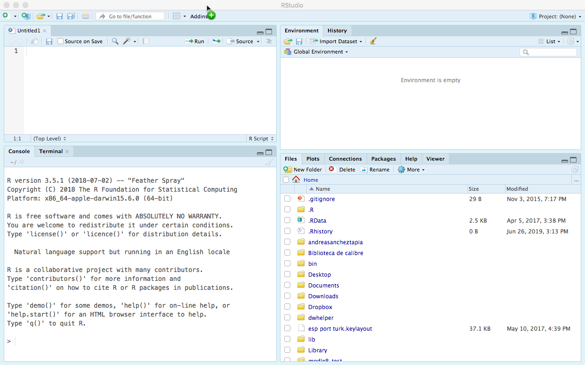

```{r setup, include=FALSE}
knitr::opts_chunk$set(echo = TRUE, results = 'hide', fig.show = "hide")
library(knitr)
library(kableExtra)
```

## Instalação 

Neste tutorial vamos fazer a configuração inicial do computador para poder trabalhar usando fluxos de trabalho reprodutíveis, desde o tratamento dos dados até a redação dos documentos finais.

Para começar, verifique que seu computador tem instalados estes programas:

+ R https://cran.r-project.org
+ RStudio https://www.rstudio.com
+ git https://git-scm.com 

Você ainda deve ter um programa de gestão de planilhas, como Excel, openOffice, ou LibreOffice. 

Use as configurações padrão durante a instalação de git. 

## Criação da estrutura de pastas do projeto

Vamos usar o terminal do RStudio mas isto pode ser feito em qualquer terminal de mac ou linux, ou criando uma sessão de terminal de git em windows (click direito em qualquer pasta de windows, opção `new git bash`)

+ Abra RStudio

+ Abra o terminal de RStudio: `Tools > Terminal > New terminal`

+ Execute `pwd`: qual é a pasta padrão onde R acha que você está trabalhando?

`pwd` = print working directory

+ Decida onde você vai querer criar seu projeto

### Navegando pelo sistema de pastas do computador

+ Execute `ls`. O que você está vendo? 

+ `ls` lista os objetos na pasta atual

+ Você vai trabalhar numa subpasta da pasta atual? o comando `cd` significa `change directory` e permite que você navegue até qualquer localidade do computador

+ Você pode usar caminhos absolutos, por exemplo: 
`cd /Users/andreasancheztapia/Documents/`

+ Mas muitas vezes faz mais sentido navegar usando caminhos relativos. Por exemplo. 
  + Ao executar `pwd`estou em `/Users/andreasancheztapia/Documents/`

+ Ao executar `ls` há várias pastas: 

```bash
1_documentos_importantes        4_aulas
1_andreasancheztapia            4_cursos
1_caparaó                       5_revisiones
1_liibre                        6_rladiesrio
1_modleR                        7_python
2_coleguinhas                   asia.pdf
2_data_analysis                 
```

+ Se quero ir até `/2_data_analysis` só preciso digitar `cd 2_data_analysis`
Aliás só digitando `2_d` e tabulação, o terminal vai autocompletar pois não há ambiguidade no nome (se eu digitar apenas `2` e tab ainda há ambiguidade então o terminal só autocompleta até `2_`)

__A localização atual e a localização relativa da pasta de destino são suficientes para o computador entender.__

+ __NOTA__ Se precisar subir um nível durante a navegação, a pasta de cima é `..`, basta digitar `cd ..`

+ Lembre que sempre pode checar sua localização digitando `pwd`

# Criando a pasta de trabalho 

Vamos imaginar que a pasta `2_data_analysis` está vazia, e portanto o comando `ls` não retorna nada. 

Para criar uma pasta nova desde o terminal, utiliza-se o comando `mkdir` ("_make directory_"):
`mkdir curso`

O comando `ls` vai retornar a pasta recém criada. 

## Criando subpastas

+ Navegue até dentro da nova pasta e crie as seguintes subpastas: `data`, `R`, `docs`, `output`, `figs`

A pasta do projeto deveria ter a estrutura seguinte: 

```bash
projeto/
    ├── data/
    ├── docs/
    ├── figs/
    ├── R/
    └── output/
```

Ela pode ser inspeccionada digitando `ls`, no explorador de arquivos do seu computador ou na aba "Files" do RStudio. 

## Criando o README

O último comando inicial importante é a criação do arquivo README na pasta do projeto, para isto é usado o comando `touch`. 

A criação de um arquivo sem extensão é possível, ex. `touch README`, mas o computador não vai saber com qual programa abrir. Outra opção seria a extensão `.txt` para abrir no bloco de notas. Afinal a extensão de um arquivo é apenas um jeito de indicar o computador com qual programa o arquivo deve ser aberto, e vários formatos de texto podem ter as extensões trocadas.

Aqui vamos usar `markdown`, um formato de texto que pode ser interpretado em várias plataformas. A extensão para arquivos markdown é `.md`, portanto o comando vai ser `touch README.md`

O comando `ls` deve agora refletir a criação deste arquivo: 

```bash
project/
    ├── data/
    ├── docs/
    ├── figs/
    ├── R/
    ├── output/
    └── README.md
```

Ao fazer click desde dentro do RStudio, ele abre o README.md e este pode ser editado facilmente. 


```{r, echo = F}

```

