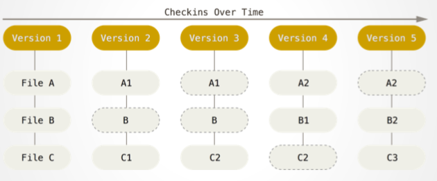
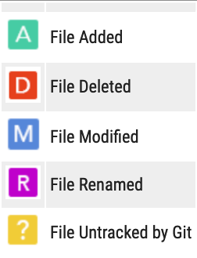
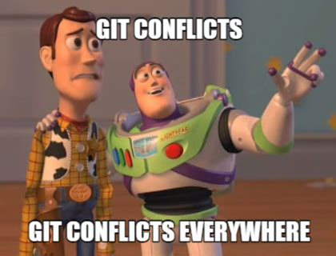

class: middle, center

# ontem

---
## hoje: controle de versões

```{r setup, include=FALSE}
options(htmltools.dir.version = FALSE)
```

```{r xaringan-themer, include = FALSE}
library(xaringanthemer)
duo_accent(
  primary_color = "#A70000",
  secondary_color = "#ff0000",
  white_color = "white",
  
  header_font_google = google_font("Roboto Condensed"),
  text_font_google   = google_font("Roboto Condensed", "300", "300i"),
  code_font_google   = google_font("Ubuntu Mono"), text_font_size = "30px"
)
```

```{r, eval = F}
project/
    ├── data/
    ├── docs/
    ├── figs/
    ├── R/
        └── script.R  #<<
    ├── output/
    └── README.md
```

---
## como trabalhar?

```{r, eval = F}
project/
    ├── data/
    ├── docs/
    ├── figs/
    ├── R/
        └── script.R  #<<
    ├── output/
        └── resultado.csv  #<<
    └── README.md
```

---
## como trabalhar?

```{r, eval = F}
project/
    ├── data/
    ├── docs/
    ├── figs/
    ├── R/
        └── script.R  #<<
        └── script_modificado.R  #<<
    ├── output/
        └── resultado.csv  #<<
        └── resultado2.csv  #<<
    └── README.md
```

---
## como trabalhar?

```{r, eval = F}
project/
    ├── data/
    ├── docs/
    ├── figs/
    ├── R/
        └── script_old.R #<<
        └── script_modificado.R  #<<
    ├── output/
        └── resultado_apagar?.csv #<<  
        └── resultado2.csv  
        └── resultado_final.csv  #<<
    └── README.md
```

---
## como trabalhar?

```{r, eval = F}
project/
    ├── data/
    ├── docs/
    ├── figs/
    ├── old_apagar/ #<< 
    ├── R/
        └── 200210_script.R  #<<
    ├── output/
        └── resultado_final.csv  #<<
        └── 200212_resultado_final.csv  #<<
    └── README.md
```

---
background-image:url("./figs/phdcomics.gif")
background-size: 50%
---
## assim...

+ qual a diferença entre `resultados_1.csv` e `resultados_2.csv`?
+ a data `200210_script.R` diz respeito à criação do script? à última modificação? 
+ algum arquivo foi apagado? algum trecho de código sumiu? 

<center>

```{r, echo = F, out.width=250}
knitr::include_graphics("https://media.giphy.com/media/JIX9t2j0ZTN9S/giphy.gif")
```

</center>

---
## controle de versões

+ sistemas que permitem: 
  + registrar mudanças ao longo do tempo
  + voltar atrás se houver algum erro
  + entender a diferença entre uma versão e outra do mesmo arquivo
  + colaborar: __compartilhar__ as análises e __trabalhar em equipe__ 
  
---

```{r, echo = F, out.height=80}
knitr::include_graphics("./figs/logo-git.png")
```

+ software __libre__
+ distribuído (ninguém tem uma "cópia principal")
+ __clones__  e ramificações (___branches___) entre computadores ou usuários

```{r, echo = F, out.height=80}
knitr::include_graphics("./figs/GitHub_Logo.png")
knitr::include_graphics("./figs/gitlab-logo-gray-rgb.png")
knitr::include_graphics("./figs/btibucket.png")
```

+ __hospedagem web__ para repositórios de git (___remotes___)
+ ferramentas para facilitar a colaboração


---
```{r, echo = F, out.height=80}
knitr::include_graphics("./figs/logo-git.png")
```

+ controla detalhadamente o conteúdo de __arquivos de texto__: `.txt`, `.csv`, `.md`, `.R`
+ pode incluir outro tipo de arquivos (binários)
+ o usuário decide __quais arquivos__ incluir
+ serve __localmente__ e __offline__
+ se comunica com __servidores remotos__ que servem de _backup_ e para distribuir (colaboração)

### trabalho > __mudanças__ >  __salvar uma versão__ > __mandar as versões para o remoto__

---
## quatro estados

+ _working directory_: arquivo adicionado para ser monitorado -> avisa quando for modificado
--

+ _staging area_: `add` arquivos/mudanças adicionadas
--

+ `commit`: cria uma versão com os arquivos adicionados
--

+ `push`: manda para o remoto os commits que ainda não tiverem sido enviados

__vários arquivos por _commit_, vários _commits_ por _push___

---
## fluxo básico de trabalho (sem ramificações)

```{r, echo=F}

```

--

+ commits sequenciais em um ou vários computadores
+ você-do-passado é seu melhor colaborador `<3`

---
class: middle, center

```{r, echo=F}

```

---
## os comandos básicos de git (__terminal__)

`git init` inicia um repositório   
`git clone URL` clona um repositório já existente

--

`git status` checa em que pé está

--

`git pull origin master` atualiza o repo localmente

--

`git add filename` adiciona um arquivo novo ou mudanças a arquivos monitorados

--

`git commit -m "uma mensagem informativa"` __cria uma versão__

---
## conexão local (git) a remoto (GitHub)

`git remote -v` vê os remotos

--

`git remote add origin [URL]` adiciona remoto e dá um nome

--

`git push origin master` - manda os _commits_ locais para github

--

`git pull origin master` - puxa os _commits_ de github para o computador local 

---
## fluxo de trabalho - Primeira vez

`git init`  
--

`git remote add`  
--

`(...)`  
--

`git add arquivo1 (novo)`  
--

`(...)`  
--

`git add arquivo2 (novo)`  
--

`git commit`  
--

`(...)`  
--

`git add arquivo1 (modificado)`  
--

`(...)`  
--

`git add arquivo3 (novo)`  
--

`git commit`  
--

`git push -u`  

---

## as vezes seguintes

`git pull origin master` (__essencial__)   
--

`(...)`  
--

`git add arquivo4`  
`git add arquivo2 (modificado)`  
`etc.`  
--

`git commit`  
--

`git push origin master`  


---
class: middle, center

# vamos configurar git no computador e depois transformar nosso projeto de RStudio em um repositório de git

---
## explorando GitHub

+ Que tipos de arquivo você reconhece?
+ O que há no final da página?
+ Quando o repositório foi criado?
+ Quando foi o último _commit_?

+ GitHub: __Issues__

---
## dicas gerais


+ GitHub __não é uma nuvem__ para _backup_ de arquivos
--

+ controlar apenas __arquivos de texto__ (texto simples ou código)
--

+ usar o arquivo `.gitignore` para que o git ignore arquivos que não serão controlados e existem só localmente no seu computador

---
## `.gitignore`

+ __Git só vai controlar o que você adicionar__
--

+ __Não é preciso adicionar tudo__ (rascunhos, testes, arquivos binários): o arquivo `.gitignore`
--

+ __Arquivos muito grandes__ (*.tiff) vão esgotar o limite do repositório (2G GitHub e Bitbucket, 10G em GitLab)
--

+ Arquivos binários (*.pdf, +.docx) até podem ser adicionados mas ocupam espaço e __git não entende modificações detalhadas__
--

+ aceita expressões gerais:
  `*.pdf`
  `/docs`
  `*.docx`
  `*.xlsx`
  
---
## desde RStudio

+ abra o projeto de RStudio de novo: aba `git`

.pull-left[

]

---
class: middle, center
## trabalhando com _branches_ e _forks_

---
background-image:url("./figs/feature-branch.png")

## fluxo de trabalho por característica (_feature_)

---
background-image:url("./figs/gitflow.png")

## fluxo de trabalho _gitflow_: proteger o branch `master`

---
background-image:url("./figs/jennifer_gilbert.png")

---
## trabalhando com _branches_

+ um usuário pode trabalhar em vários _branches_

+ vários usuários podem trabalhar em um repositório mas em _branches_ diferentes

+ cada usuário pode ter uma cópia própria do repositório inteiro ("_fork_") e mesmo assim colaborar - `merge` e `pull request` de GitHub

---
## trabalhando com _branches_

--

`git branch NOME` para criar um _branch_ (uma ramificação)

--

`git checkout NOME` para trocar de _branch_

--

`git merge branch1 branch2` para juntar _branches_

---
## git pode ser complicado



---
## conflitos 

+ resolve manualmente
+ faz um clone do zero e corrige os erros

---
background-image: url(./figs/xkcd.png)
class: center, middle

---
## boas práticas

1. descrever no commit (o porquê da) mudança

1. trabalhar uma tarefa em cada _branch_

1. usar `.gitignore` para ignorar alguns arquivos que não devem ser monitorados (ex. arquivos do sistema)

1. usar modo `diff` para acompanhar mudanças no código

1. reportar erros no código em `issues` no GitHub


---

## hoje: 

+ configuramos git em nosso computador
+ transformamos o projeto de RStudio em um repositório de git
+ configuramos um remoto de GitHub para esse repositório
+ modificamos `R/script.R` e o progresso ficou salvo em dois _commits_
+ podemos começar a usar esta estrutura de trabalho


---
## mais referências

+ Getting started with Git and GitHub for R users https://saghirb.github.io/shared/Getting-Started-with-Git-and-GitHub-for-R-Users.html#1

+ A página oficial de git e o tutorial oficial https://git-scm.com/doc/ext
, https://git-scm.com/docs/gittutorial

+ Livro Pro Git https://git-scm.com/book/es/v1

+ Jenny Bryan - Happy Git and GitHub for the useR https://happygitwithr.com/
