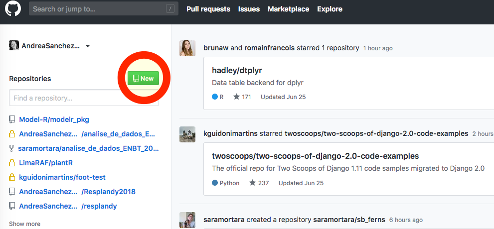
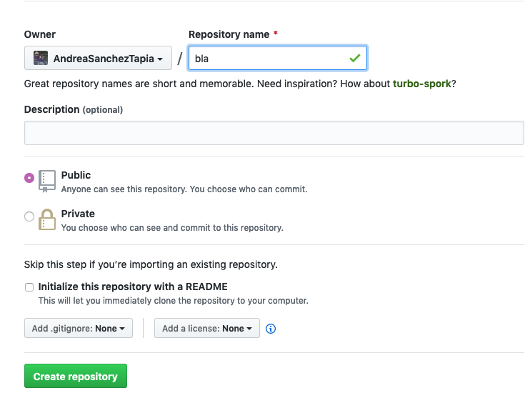
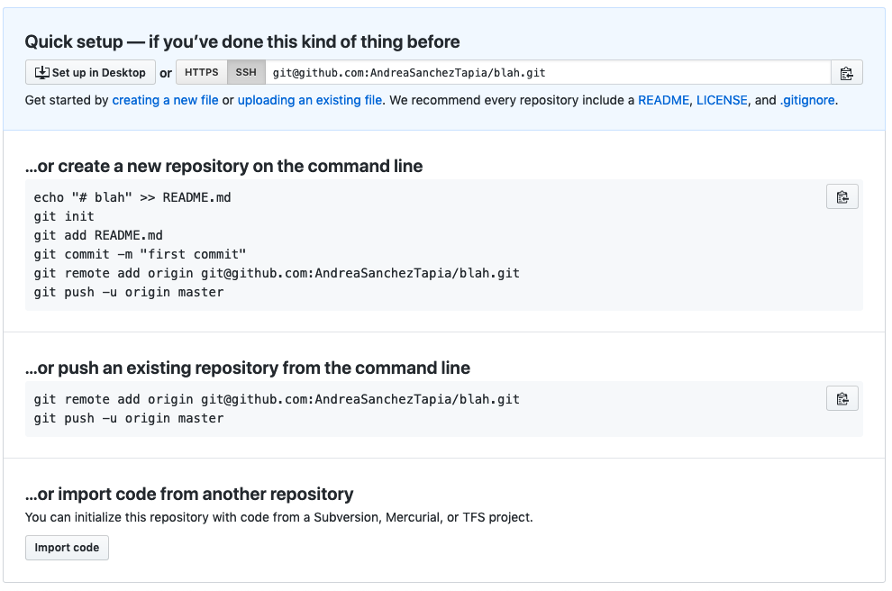

```{r setup, include=FALSE}
knitr::opts_chunk$set(echo = TRUE)
```

## Introdução

Git é o software de controle de versões mais utilizado na atualidade. Ele permite seguir as diferentes versões de seus arquivos no computador ao longo do tempo. Cada momento onde o usuário decide criar uma versão é chamado de __commit__. A diferença do trabalho em Dropbox (por exemplo) __cada commit é um momento discreto e decidido pelo usuário__. Não há uma atualização contínua. Isto permite saber/decidir quais são as modificações relevantes e separar o trabalho em etapas.

Um __repositório__ de git é __uma pasta__ onde a última versão de cada arquivo está visível, porém o historial inteiro de _commits_ dos arquivos está disponível, pode ser explorado, revertido. Com git o usuário sabe o que foi acrescentado, modificado, apagado em cada commit, e portanto não precisa criar versões duplicadas de arquivos, ou renomear ao longo do trabalho. 

Git funciona localmente, mas também permite estabelecer __repositórios remotos__. Isto permite trabalhar desde diferentes computadores, com diferentes usuários e ter um backup no remoto. Nesse sentido, fala-se que git é um sistema __distribuído__ de controle de versões, onde a perda de um computador ou usuário "central" não implica na perda do trabalho inteiro. 

Na atualidade, GitHub ([www.github.com](www.github.com)) é o sistema de armazenamento de repositórios de git mais conhecido e utilizado. No entanto, as instituições podem implementar servidores para que eles sirvam como remotos, e há outros serviços similares, como __Gitlab__ ([www.gitlab.com](www.gitlab.com), nosso favorito <3) e __Bitbucket__ ([www.bitbucket.com](www.bitbucket.com)).

Git pode ser usado em qualquer pasta do computador e é um sistema independente do fluxo de trabalho em R. Ele foi desenvolvido por Linus Torvalds para poder colaborar com os diferentes autores de linux e para poder trabalhar _offline_ (entre _commits_). Neste tutorial vamos configurar o computador para que os projetos de análise de dados consigam aproveitar as vantagens de git e os fluxos de trabalho fiquem mais organizados. 

Este tutorial está inspirado no [curso de R](https://pagepiccinini.com/r-course/) da [Page Piccinini](https://twitter.com/pageinini)

# Configuração de git no computador

Primeiro vamos fazer a configuração de git no computador. Para isto abra uma janela de terminal no RStudio.

## Identificação

Todo comando de git no terminal começa por `git` ;) 
Vamos inserir nome e o email para identificação: 

Digite: 
`git config --global user.name`   
`git config --global user.email`   

A primeira vez nada deve aparecer, se algo aparecer é porque já tinha sido rodado.

Se não tiver resposta ou se houver algum erro no retorno, execute:  

`git config --global user.name [seu nome]`  
`git config --global user.email [seu email do github!]`   

ex. `git config --global user.name "Andrea Sánchez-Tapia"`
ex. `git config --global user.email katori@gmail.com`

As aspas no nome permitem que git entenda que o nome completo com espaços é o `user.name`.

Na checagem, os dados inseridos devem aparecer,  digite de novo: 
`git config user.name`   
`git config user.email`   

As variáveis que você inseriu devem aparecer

__Até aqui git está configurado no computador e ele sabe quem é você.__

# Criando um repositório de git e GitHub

Tem vários caminhos para criar o repositório local de git que consiga se comunicar remotamente com GitHub, GitLab ou Bitbucket. Neste caso, já temos uma pasta local portanto precisamos apenas __iniciar git localmente__ e __criar um repositório remoto e adicioná-lo localmente__. 

Em outros fluxos de trabalho, você pode querer criar o repositório diretamente no GitHub e _clonar_ ele para seu computador, e só adicionar conteúdo posteriormente.

Em geral, leia as instruções disponíveis nos serviços de hospedagem :) Os helps de GitHub, GitLab e Bitbucket (Atlassian) são de muita utilidade. 

## Localmente

1. Sempre cheque: `git status`

__isto ainda não é um repositório de git:__

`fatal: not a git repository (or any of the parent directories): .git`

2. No terminal: `git init`

`Initialized empty Git repository in /Users/andreasancheztapia/Desktop/projeto_area_de_trabalho/.git/`

3. Veja se há remotos para esta pasta: `git remote -v` Nada, não é?

__Vamos criar e adicionar um repositório remoto criado no GitHub __


Lembre sempre de checar: 

`git status`

Neste momento a mensagem no terminal deveria ser: 


`On branch master`  
`No commits yet`  
`Untracked files:...`  

# Trabalhando no repo

Vamos fazer uma modificação ao README.md, adicionar as mudanças (`add`), fazer commit (`commit`) e fazer push (`push`).

1. Edite seu README.md de maneira interessante e significativa - 

2. Adicione seu README.md: isto quer dizer que o git vai começar a monitorar este arquivo. 

`git add README.md`

__Faça sempre `git status` entre passos para entender o que está acontecendo __

3. Vamos fazer o commit deste arquivo que foi adicionado. O commit exige que você escreva uma mensagem explicando porque você fez as mudanças: 

`git commit -m "eu fiz as mudanças porque era bom"`

`[master b9cdaf7] eu fiz as mudanças porque era bom`  
`1 file changed, 1 insertion(+)`

##  Vamos conectar o computador com GitHub 

__VOCÊ SÓ PRECISA FAZER ISTO UMA VEZ EM CADA COMPUTADOR__

Para isso, geramos uma chave de segurança que identifica o computador e copiamos ela no GitHub. 

Esta chave é _para cada computador individual_. Você pode ter uma conta de GitHub só mas trabalhar em diferentes computadores, e cada um terá a própria chave. 

### em RStudio: criar a chave RSA

1. Nas opções de RStudio, busque a opção `Preferências > git/svn`
1. Checar que git está apontando para um arquivo `git.exe` em windows, em mac e linux `/usr/bin/git`
3. Se você nunca fez isto, não deve ter nada no campo da chave RSA, clique `Criar RSA Key`. Se já tiver algo, passe para o passo seguinte.
5. Veja a RSA Key, copie a chave. Ela é uma chave que identifica seu computador e vamos copiá-la em GitHub.com

### em GitHub: colar a chave RSA

1. Log in
2. __Perfil > Chaves ssh > criar uma chave ssh__
4. Nome de seu computador
5. Colar a chave que tinha sido copiada. 
6. Add, OK. 

__Até aqui github e seu computador podem se comunicar :D Esta configuração da chave só precisa ser feita uma vez em cada computador. O resto precisa ser rodado toda vez que você crie um repositório__


## em GitHub

1. Novo repositório (botão verde) 



2. Bote um nome, crie como público, __sem readme porque você já tem um readme localmente__.  



2. Vai abrir uma página de instruções



__A gente vai adicionar o remoto, copie a opção SSH do quadro de cima__ 

`git@github.com:AndreaSanchezTapia/blah.git`


Volte para o terminal local e adicione este remoto:

`git remote add origin` + cole o conteúdo com `ctrl + v` 

`git remote add origin git@github.com:AndreaSanchezTapia/blah.git`


__Você acaba de adicionar o remoto que criou no GitHub__


Cheque se este existe: 

`git remote -v`

A resposta deve ser algo similar a isto: 

`$ origin	git@github.com:AndreaSanchezTapia/blah.git (fetch)`  
`$ origin	git@github.com:AndreaSanchezTapia/blah.git (push)`

__Até aqui você tem um remoto e um repositório local__

4. Agora só falta você fazer push do _commit_ 

`git push -u origin master`

O `-u` marca um "upstream": qualquer mudança no remoto pode ser recuperada localmente

A mensagem de push deve ser similar a esta: 

`Warning: Permanently added the RSA host key for IP address '18.228.52.138' to the list of known hosts.` 
`Enumerating objects: 5, done.`  
`Counting objects: 100% (5/5), done.` 
`Writing objects: 100% (3/3), 313 bytes | 313.00 KiB/s, done.`  
`Total 3 (delta 0), reused 0 (delta 0)`  
`To github.com:AndreaSanchezTapia/blah.git`  
   `af45751..b9cdaf7  master -> master`  


---

Faça mais uma edição no README.md e repita os passos 2 a 4: `add`, `commit`, `push`


---
## Vamos para GitHub: o que mudou?
 
+ Vamos explorar a página do repositório


