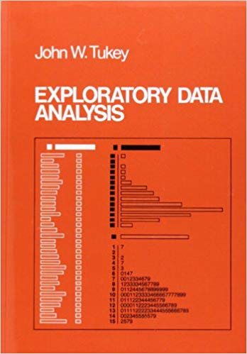

```{r setup, include=FALSE}
knitr::opts_chunk$set(size = "footnotesize")
options(tinytex.verbose = TRUE)
library(GGally)
```

## sobre a aula

1. análise exploratória de dados

2. estatísticas descritivas

3. gráficos

4. relações entre variáveis


# 1. análise exploratória de dados (AED)
 
## a vida sem análise exploratória de dados

{width=400}


## \emph{Explanatory Data Analysis} de John Tukey

{width=150} \hspace{3cm} {width=100}

## conheça seus dados!

\begin{figure}
\begin{center}
\includegraphics{figs/pee.jpg}
\end{center}
\end{figure}


## objetivos da AED

1. \pause controlar a qualidade dos dados

2. \pause sugerir hipóteses para os padrões observados

3. \pause apoiar a escolha dos procedimentos estatísticos de testes de hipótese

4. \pause avaliar se os dados atendem às premissas dos procedimentos estatísticos escolhidos

5. \pause indicar novos estudos e hipóteses 


## \Huge \alert{alerta!}


\pause análise exploratória não é \alert{tortura} de dados

{width=300}

\pause assume-se que pesquisador(a) formulou \emph{a priori} \textbf{hipóteses} plausíveis amparadas pela \textbf{teoria}

## dicas

\begin{itemize}

\pause \item não existe receita! 

\pause \item pode levar entre 20 e 50\% do tempo das análises

\pause \item deve ser iniciada ainda durante a coleta de dados

\pause \item utiliza-se largamente técnicas visuais

\end{itemize}

{width=200}

## importânica do gráfico e quarteto de \alert{Anscombe}

\begin{itemize}

\item criado pelo matemático Francis Ascombe

\item 4 conjuntos de dados com as mesmas estatísticas descritivas, mas muito diferentes graficamente

\end{itemize}


\center \includegraphics{figs/Francis_Anscombe.jpeg}

## os dados de \alert{Anscombe}

```{r, echo=FALSE}
library(wesanderson)
cor <- wes_palette("Rushmore1") #("FantasticFox1")
```


\scriptsize
```{r, echo=TRUE}
# claro que o conjunto já existe dentro do R
data("anscombe")
```

```{r, echo=TRUE}
# estatisticas descritivas
summary(anscombe)
```

## outras estatíticas

\scriptsize
```{r}
apply(anscombe, 2, var)
```

## vamos olhar para os dados

\footnotesize
```{r,echo=FALSE}
anscombe
```


## correlação entre x e y 

\footnotesize
```{r, echo=TRUE}
# correlação
cor(anscombe$x1, anscombe$y1)
cor(anscombe$x2, anscombe$y2)
cor(anscombe$x3, anscombe$y3)
cor(anscombe$x4, anscombe$y4)
```

## agora sim vamos olhar para os dados do Anscombe

```{r, echo=FALSE, fig.align='center', fig.width=3.8, fig.height=3.5}
cor.c <- "grey40"
par(mfrow = c(2, 2), bty = 'l', las = 1, mar = c(3.8, 3.8, 2, 2))
plot(y1 ~ x1, data = anscombe, pch = 19, col = cor[2])
abline(lm(y1 ~ x1, data = anscombe), lwd = 2, col = cor.c)
plot(y2 ~ x2, data = anscombe, pch = 19, col = cor[3])
abline(lm(y2 ~ x2, data = anscombe), lwd = 2, col = cor.c)
plot(y3 ~ x3, data = anscombe, pch = 19, col = cor[4])
abline(lm(y3 ~ x3, data = anscombe), lwd = 2, col = cor.c)
plot(y4 ~ x4, data = anscombe, pch = 19, col = cor[5])
abline(lm(y4 ~ x4, data = anscombe), lwd = 2, col = cor.c)
par(mfrow = c(1, 1))
```

## perguntas que nos devemos fazer

1. Onde os dados estão centrados? Como os dados estão distribuídos? Os dados são simétricos, assimétricos, bimodais?

2. Existem outliers?

3. As variáveis seguem uma distribuição normal?

4. Existem relações entre as variáveis? As relações entre variáveis são lineares?

5. As variáveis precisam ser transformadas?

6. O esforço amostral foi o mesmo para cada observação ou variável?

# 2. estatísticas descritivas

## conferência de dados no R

\footnotesize
```{r, echo=TRUE}
# lendo os dados gerados no script de manipulacao de dados
dados <- read.csv("data/01_data_format_combined.csv")
# lendo os dados com variáveis ambientais
envir <- read.csv("data/cestes/envir.csv")
# variaveis ambientais sem Site
envir.vars <- envir[, -1]
```

## \color{white}{} 

\scriptsize
```{r, echo=TRUE}
str(dados)
```


## \color{white}{} 

\scriptsize
```{r, echo=TRUE}
summary(dados)
```

## perguntas que devemos fazer aos dados #1

 1.  \pause existem valores faltantes i.e. (\alert{NA}s)? Eles são mesmo faltantes?

## teste lógico para encontrar \alert{NA} e \alert{zero}

\scriptsize
```{r, echo=TRUE}
apply(dados, 2, function(x) sum(is.na(x)))
```


## perguntas que devemos fazer aos dados #2

2. \pause existem muitos \alert{zeros}?

\scriptsize
```{r, echo=TRUE}
dados$Abundance == 0
```

## quantos?

```{r, echo=TRUE}
sum(dados$Abundance == 0)

# qual a proporção?
sum(dados$Abundance == 0)/nrow(dados)
```

## perguntas que devemos fazer aos dados #3 #4 #5

3. \pause  onde os dados estão centrados? como estão espalhados? são simétricos? enviesados, bimodais?


4. \pause  existem valores extremos (outliers)?


5. \pause  qual a distribuição da variável?


## medidas de tendência central

\footnotesize
```{r mean}
# media
mean(dados$Abundance)
# mediana
median(dados$Abundance)
# valor mais frequente na amostra 
freqf <- sort(table(dados$Abundance), 
              decreasing = TRUE)
freqf[1]
```

## medidas de dispersão

\scriptsize
```{r disp}
# variancia
var(dados$Abundance)
# desvio padrão
sd(dados$Abundance)
# coeficiente de variação
sd(dados$Abundance)/mean(dados$Abundance)*100
# intervalo
range(dados$Abundance)
diff(range(dados$Abundance))
```

## quantis e intervalo inter-quantil (IIQ)

\scriptsize
```{r qq}
# quantis
quantile(dados$Abundance)
# lembrando da saida do summary
quantile(dados$Abundance)
# mudando os quantis 
quantile(dados$Abundance, probs = c(0.05, 0.5, 0.95))
# intervalo inter-quantil
IQR(dados$Abundance)
```

# 3. gráficos

## visualizando os dados em um boxplot

```{r, fig.align='center', echo=TRUE, fig.width=4, fig.height=4}
boxplot(dados$Abundance)
```

## entendendo o boxplot

```{r, echo=FALSE, fig.show='asis', fig.align='center', fig.width=6, fig.height=5}
set.seed(2)
par(bty = "n")
bp <- rnorm(1000, 0, 0.1)
boxplot(bp, yaxt = "n", xlim = c(0, 3), ylim=c(-0.3, 0.3))
text(x = 1.82, y = min(bp), "último ponto (-1,5 x IIQ)", cex = .9)
text(x = 1.72, y = quantile(bp)[2], "primeiro quartil", cex = .9)
text(x = 1.72, y = median(bp), "mediana", cex = .9)
text(x = 1.72, y = quantile(bp)[4], "terceiro quartil", cex = .9)
text(x = 1.82, y = bp[203], "último ponto (+1,5 x IIQ)", cex = .9)
arrows(x0 = 0.68, x1 = 0.68, y0 = quantile(bp)[2], y1 = quantile(bp)[4], code =
         3, length = 0.05)
text(x = 0.54, y = median(bp), "IIQ", cex = .9)
```

## visualizando os dados em um histograma

```{r, fig.align='center', echo=TRUE, fig.width=3, fig.height=3}
hist(dados$Abundance)
```

## tipos de histograma

\footnotesize
```{r, echo=TRUE, fig.width=9, fig.height=4.5}
par(mfrow = c(1,2))
hist(dados$Abundance)
hist(dados$Abundance, probability = TRUE)
par(mfrow = c(1,1))
```

## classes do histograma

\footnotesize
```{r, echo=TRUE, fig.width=9, fig.height=3}
par(mfrow = c(1,3))
hist(dados$Abundance, 
     breaks = seq(0, max(dados$Abundance), length = 3))
hist(dados$Abundance,  
     breaks = seq(0, max(dados$Abundance), length = 5))
hist(dados$Abundance)
par(mfrow = c(1,1))
```

## curvas empíricas de densidade probabilística

representa a função que descreve a probabilidade de se encontrar determinado valor

\scriptsize
```{r, echo=TRUE, fig.width=3, fig.height=3, fig.align='center'}
hist(dados$Abundance, probability = TRUE )
```

## curvas empíricas de densidade probabilística

\scriptsize
```{r dens}
plot(density(dados$Abundance))
```

## distribuição se ajusta aos dados?

distribuição discreta e assimétrica \textbf{$\rightarrow$} Poisson?

\footnotesize
```{r, echo=TRUE}
# máximo de abundância
ab.max <- max(dados$Abundance)
# lambda
ab.med <- mean(dados$Abundance)
```

## distribuição \alert{Poisson} se ajusta aos dados?

\footnotesize
```{r, echo=TRUE, fig.width=3, fig.height=3, fig.align='center'}
hist(dados$Abundance, probability = TRUE)
points(dpois(0:ab.max, ab.med), col = cor[5])
lines(dpois(0:ab.max, ab.med), col = cor[5])
```

# \Huge (distribuições estatístcas)

## distribuição normal ou gaussiana


```{r echo=FALSE, fig.width=4, fig.height=4, fig.align='center'}
set.seed(42)
a <- rnorm(200, 8, 1)
b <- rnorm(200, 8, 1.5)
c <- rnorm(200, 8, 2.5)
curve(dnorm(x, mean(a), sd(a)), col = "darkblue", lwd = 2,
      ylim = c(0, 0.5), xlim = c(4, 12),
      xaxt = "n", yaxt = 'n', xlab = '', ylab = '')
curve(dnorm(x, mean(b), sd(b)), col = "darkred", lwd = 2,
      ylim = c(0,0.5), xlim = c(4, 12), add = TRUE)
curve(dnorm(x, mean(c), sd(c)), col = "darkgreen", lwd = 2,
      ylim = c(0,0.5), xlim = c(4, 12), add = TRUE)
legend('topright', lty = 1, lwd = 2, 
       legend = paste0("sd=", c(1, 1.5, 2.5)),
       col = c("darkblue", "darkred", "darkgreen"), bty ='n')
```

## por que amostragem é importante?

\scriptsize
```{r norm, echo = FALSE, fig.width=9, fig.height=3, fig.align='center'}
par(mfrow = c(1, 3))
a <- rnorm(200, 8, 1)
hist(a, prob = TRUE, main = "N = 200")
curve(dnorm(x, mean(a), sd(a)),
      col = "darkred", lwd = 2, add = TRUE)

a <- rnorm(100, 8, 1)
hist(a, prob = TRUE, main = "N = 200")
curve(dnorm(x, mean(a), sd(a)), 
      col = "darkred", lwd = 2, add = TRUE)

a <- rnorm(10, 8, 1)
hist(a, prob = TRUE, main = "N = 200")
curve(dnorm(x, mean(a), sd(a)),
      col = "darkred", lwd = 2, add = TRUE)
```


# 4. relações entre variáveis

## gráfico de dispersão

\footnotesize
```{r dispersao, fig.align = 'center'}
plot(Clay ~ Silt, 
      data = envir.vars, pch = 19)
```

## correlação entre as variáveis

\scriptsize
```{r correlacao}
cor(envir.vars)
```

## quando uma correlação é alta? \Large\alert{0.7}

\pause {width=300}

## correlação entre as variáveis

\scriptsize
```{r pairs}
pairs(envir.vars)
```

## ou ainda melhor correlação entre as variáveis

pacote __GGally__ com a função `ggpairs()`

\footnotesize
```{r cor, echo=FALSE}
ggpairs(envir.vars)
```

## e quais os caminhos para a análise?
\center sua \Huge \textbf{\alert{[ H I P Ó T E S E ]}}

## depois da \textbf{\alert{[ H I P Ó T E S E ]}}, quais os caminhos

1. \pause entender bem os dados

2. \pause variável resposta é normal? \textbf{$\rightarrow$} lm e outras análises paramétricas

3. \pause variável resposta tem outra distribuição \textbf{$\rightarrow$} análises não paramétricas, glm

4. \pause variáveis preditoras hierarquizadas? \textbf{$\rightarrow$} (g)lmm

5. \pause pseudo-replicação no espaço ou no tempo \textbf{$\rightarrow$} (g)lmm
