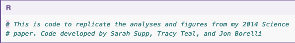
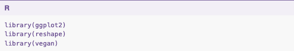
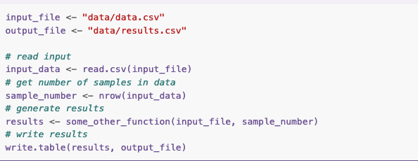

```{r setup, include=FALSE}
options(htmltools.dir.version = FALSE)
```

```{r xaringan-themer, include = FALSE}
library(xaringanthemer)
duo_accent(
  primary_color = "#A70000",
  secondary_color = "#ff0000",
  white_color = "white",
  
  header_font_google = google_font("Roboto Condensed"),
  text_font_google   = google_font("Roboto Condensed", "300", "300i"),
  code_font_google   = google_font("Ubuntu Mono"), text_font_size = "30px"
)
```

## fluxo de trabalho

+ Não faça um script único para todas as análises
    + `01_ler_formatar_dados.R`
    + `02_diversidade.R`
    + `03_pca.R`
    + `04_simulacoes.R`
    `...`

--

+ Idealmente um script começa __lendo__ algum dado e termina __escrevendo__ algum resultado.      

--

+ O script seguinte pode __ler dados brutos__ ou __resultados de scripts anteriores__. 

---
## exemplo

<small>
.pull-left[
+ `R/01_data_clean.R`
]
.pull-right[
+ lê __`data/dados_brutos.csv`__
+ escreve __`data/dados_limpos.csv`__
]

--

.pull-left[

+ `R/02_diversidade.R`
]
.pull-right[
+ lê __`data/dados_limpos.csv`__
+ escreve __`results/02_diversidade.csv`__   __`figs/02_diversidade.png`__
]

</small>

---
## exemplo
<small>
.pull-left[
+ `R/03_pca.R`
]
.pull-right[
+ lê __`data/dados_limpos.csv`__
+ escreve __`figs/03_pca.png`__
]

--

.pull-left[
+ `R/04_simulacoes.R`
]
.pull-right[
+ lê __`data/dados_limpos.csv`__
+ salva __`results/04_simulacoes.rda`__   __`figs/04_simulacoes.png`__
]

</small>

---
## exemplo

Se um objeto for pesado, ou demora muito para rodar, ele pode ser salvo como um objeto de r (__`.rda`__)  
exemplo:  
__`save(objeto, "./results/04_simulacoes.rda")`__

+ Scripts seguintes podem começar carregando esses objetos: 

Exemplo: no script `05_analisando_simulacoes.R`

__`load("results/04_simulacoes.rda")`__

_Mas nunca salve o workspace _


---
class: middle, center

## a organização de cada script

.footnote[Prints tomados de swcarpentry.github.io/r-novice-inflammation/06-best-practices-R]

---
## cada script

+ Um cabeçalho em cada script contando quem, como, quando, onde, porque __METADADOS__


--

+ Uma porção carregando todos os pacotes que serão necessários desde o início com `library()`*  <!--library da erro quando há um error enquanto require nãõ diz nada-->



---
## cada script

+  Lendo os dados que serão necessários (__workspace vazio__)



--

+ Codificando qualquer variável que não for mudar 

--

+ Comentando profusamente cada etapa
  
--

+ Escrevendo no HD o resultado de cada etapa.

---
## cada script 

+ O script deve poder ser rodado em sequência desde o início até o fim. 

  + Sem repetições,
  + Sem linhas fora da ordem
  + Sem parênteses ou chamadas que não fecham (`png` ---> `dev.off()`)

+ Você deve poder apagar o _workspace_ no meio da sessão e reconstruir

+ Não defina funções dentro do script. Bote as funções em um script e pasta aparte __`/fct/editar.R`__ e chame via __`source()`__.

---
## algumas dicas adicionais

+ Use nomes informativos e concisos
    + __`a <- `__ NO

+ Não use nomes já existentes: `cor <-` (color) `cor()`
`c <-`

+ __Se copiar e colar mais de três vezes é hora de escrever um loop ou uma função__


---
## mais dicas

+ https://owi.usgs.gov/blog/intro-best-practices/
+ https://swcarpentry.github.io/r-novice-inflammation/06-best-practices-R/
+ https://www.r-bloggers.com/r-code-best-practices/
+ https://www.tidyverse.org/articles/2017/12/workflow-vs-script/
