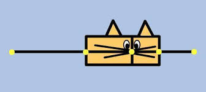

```{r setup, include=FALSE}
knitr::opts_chunk$set(echo = TRUE, results='hide', fig.show = "hide")
library(knitr)
library(kableExtra)
```

# Parte 1: O quarteto de Anscombe

Vamos agora ao R explorar alguns dados. Primeiro, veja com seus próprios comandos os dados criados pelo [Frank Anscombe](https://en.wikipedia.org/wiki/Frank_Anscombe) (1918-2001). Frank foi um estatístico que dentre suas muitas contribuições para a ciência advogou em prol do uso de gráficos para conhecer os dados. Para provar seu ponto ele criou o conjunto de dados hoje conhecido por **Quarteto de Anscombe**.

Os dados já existem dentro do R, por isso você pode carregá-los usando a função `data`. 

```{r cars}
data("anscombe")
```

## Funções básicas para checar os dados

```{r summary, results='hide'}
dim(anscombe) # dimensao dos dados, N de linhas e N de colunas
head(anscombe) # seis primeiras linhas dos dados
class(anscombe) # classe do objeto
str(anscombe) # estrutura do objeto
```

## Selecionando colunas dos dados

Vamos fazer a média por das colunas com x.

```{r pressure, results='hide'}
mean(anscombe$x1)
mean(anscombe$x2)
mean(anscombe$x3)
mean(anscombe$x4)
```

### Conhecendo a função `apply` 

A mesma tarefa mas agora com apenas uma linha de comando usando a função `apply`.

```{r, results='hide'}
# o mesmo calculo, agora apenas em 1 linha de comando
## media de todos os vetores x
apply(anscombe[,1:4], 2, mean) #aplica uma funcao a todas as linhas de um objeto
## media de todos os vetores y
apply(anscombe[,5:8], 2, mean)
```

## Descrição estatística dos dados


```{r, results='hide'}
# variância dos dados
apply(anscombe, 2, var) # aplica a funcao var a todas as linhas do objeto
```

Ententendo a correlação e coeficiente de regressão dos conjuntos x e y. 

```{r, results='hide'}
# correlação
cor(anscombe$x1, anscombe$y1)
cor(anscombe$x2, anscombe$y2)
cor(anscombe$x3, anscombe$y3)
cor(anscombe$x4, anscombe$y4)
# coeficiente de regressão
## primeiro criamos objetos com as regressoes dos quatro conjuntos
m1 <- lm(anscombe$y1 ~ anscombe$x1)
m2 <- lm(anscombe$y2 ~ anscombe$x2)
m3 <- lm(anscombe$y3 ~ anscombe$x3)
m4 <- lm(anscombe$y4 ~ anscombe$x4)
## vamos criar agora uma lista com todos os modelos para facilitar o trabalho
mlist <- list(m1, m2, m3, m4)
## agora sim podemos calcular de forma menos repetitiva os coeficientes de regressao
lapply(mlist, coef) 
```

Os dados têm mesma média, mesma variância, mesma correlação e mesmo valores dos coeficientes (intercepto e inclinação do modelo linear). Em que os dados são diferentes?

```{r, results='hide'}
anscombe
```

Os valores parecem difentes. Mas quão diferentes?

```{r, results='hide', fig.show='hide'}
# funcao par para definir as configuracoes da janela grafica entre em ?par
par(mfrow=c(2, 2), #abre uma janela gráfica com 2 linhas  e 2 colunas
    las=1, # deixa as legendas dos eixos na vertical
    bty="l") # tipo do box do grafico em L 
plot(anscombe$y1 ~ anscombe$x1) #plot das variaveis
abline(mlist[[1]]) # adicionando a reta prevista pelo modelo de regressao
plot(anscombe$y2 ~ anscombe$x2)
abline(mlist[[2]])
plot(anscombe$y3 ~ anscombe$x3)
abline(mlist[[3]])
plot(anscombe$y4 ~ anscombe$x4)
abline(mlist[[4]])
par(mfrow=c(1, 1)) # retorna a janela grafica para o padrao de 1 linha e 1 coluna
```

# Parte 2: Uma rotina (entre muitas possíveis) de análise exploratória

## Padrões morfológicos de espécies de *Iris*

O conjunto de dados `iris` que vocês já utilizaram, foi coletado por Edgar Anderson e ficou famoso pelo trabalho de Ronald E. Fisher. Vamos carregar os dados no R. 


```{r, results='hide',echo=FALSE}
data(iris)
```

Após carregar o conjunto de dados, use o comando `?iris` para entender mais sobre o conjunto de dados. Vamos então começar com as inspeções básicas do arquivo.

```{r, results='hide'} 
head(iris)
summary(iris) 
```

## Conhecendo as funções `aggregate` e `tapply`

Quantas informações por espécie?

```{r, results="hide"}
table(iris$Species)
```

Qual a média das variáveis por espécie? Vamos usar as funções `agreggate` e `tapply`. As duas funções são semelhantes, o que muda são os argumentos e o formato de saída de cada uma delas. 

```{r, results="hide"}
# media do comprimento de sepala por especie
tapply(X = iris$Sepal.Length, INDEX = list(iris$Species), FUN = mean)
# a mesma tarefa, executada por outra funcao. Outros argumentos e outra saída
aggregate(x = iris$Sepal.Length, by = list(iris$Species), FUN = mean)
# ainda a mesma tarefa, com a mesma função mas em uma notação diferente
aggregate(Sepal.Length ~ Species, data = iris, mean)
```

Podemos fazer o mesmo para as outras variáveis.

```{r}
aggregate(Sepal.Length ~ Species, data = iris, mean)
aggregate(Sepal.Width ~ Species, data = iris, mean)
aggregate(Petal.Length ~ Species, data = iris, mean)
```

E agora vamos calcular o desvio padrão das variáveis. 

```{r}
tapply(X = iris$Sepal.Length, INDEX = list(iris$Species), FUN = sd)
tapply(X = iris$Sepal.Width, INDEX = list(iris$Species), FUN = sd)
tapply(X = iris$Petal.Length, INDEX = list(iris$Species), FUN = sd)
tapply(X = iris$Petal.Width, INDEX = list(iris$Species), FUN = sd)
```

Sempre que você está copiando e colando um comando, pense que existe uma maneira melhor de executar a sequência de tarefas. Afinal, se você tivesse 99 variáveis, copiar e colar 99x um comando não parece uma boa ideia. Veja abaixo uma solução de como calular a média por espécie de todas as variáveis. Para isso, vamos usar o comando `for` e executar todas as tarefas em um mesmo ciclo. 

```{r}
# criando matriz de 3 colunas - uma para cada sp - e 4 linhas - uma para cada metrica
medias <- matrix(NA, ncol = 3, nrow = 4)
# definindo o nome das colunas e das linhas da matriz
colnames(medias) <- unique(iris$Species)
rownames(medias) <- names(iris)[-5]
for (i in 1:4){
medias[i,] <- tapply(iris[,i], iris$Species, mean)  
}
```

Se você chamar o objeto `medias` deverá ter algo como: 

```{r, echo=FALSE, results="show"}
knitr::kable(medias) %>% 
  kable_styling(full_width = F)
```

## Estatísticas descritivas

$% fonte: http://ncss-tech.github.io/stats_for_soil_survey/chapters/4_exploratory_analysis/4_exploratory_analysis.html#4_descriptive_statistics$

As princpais estatísticas descritivas que vamos utilizar são:

| Parâmetro     | Descrição     | Função de R  |
|------|-------------|--------|
| Média          | média aritimética | mean() |
| Mediana       | valor central      |   median() |
| Moda          | valor mais frequente      |   sort(table(), decreasing = TRUE)[1] |
| Desvio padrão | variação em torno da média | sd() |
| Quantis | pontos de corte  dividindo uma distribuição de probabilidade  | quantile() |

### Medidas de tendência central

#### Média

$\overline{x}= \frac{\sum^{n}_{i=1}x_i}{n}$

```{r}
vars <- iris[, -5]
apply(vars, 2, mean)
```


#### Mediana: 50º quantil, de forma que divide os dados em duas metades

```{r}
apply(vars, 2, median)
```

#### Moda: valor mais frequente na amostra


```{r}
freq_sl <- sort(table(iris$Sepal.Length), decreasing = TRUE)
freq_sl[1]
```


### Medidas de dispersão 

#### Variância: desvio da média
$s^{2}=\sum^{n}_{i=1}\frac{(x_i−\overline{x})^2}{n−1}$

```{r}
apply(vars, 2, var)
```

#### Desvio padrão: raiz quadrada da variância

$s=\sqrt{\sum^{n}_{i=1}\frac{(x_i−\overline{x})^2}{n−1}}$

```{r}
sd01 <- apply(vars, 2, sd)
# outra forma:
sd02 <- apply(vars, 2, function(x) sqrt(var(x)))
sd01
sd02
sd01 == sd02
```

#### Coeficiente de variação: medida relativa de desvio padrão 

$CV=\frac{s}{\overline{x}}\times100$

Não existe no R base uma função para calcular o coeficiente de variação. Isto não é um problema. Vamos formalmente criar nossa primeira função de R. Para isso, usamos a função `function`

```{r}
cv <- function(x){
  sd(x)/mean(x)*100
}
apply(vars, 2, cv)
```

#### Quantis ou percentis

É o valor que corta a enésima porcentagem de valores dos dados quando ordenados de forma ascendente. Por padrão, a função `quantile` retorna o mínimo, o 25º percentil, a mediana, o 50º percentil, o 75º percentil e o máximo, também conhecidos pelo sumário de cinco números proposto por Tuckey (que também é o retorno da função `summary` de um vetor numérico). Os cinco números dividem os dados em quatro quantis, que, por isso são chamados de **quartis**. Os **quartis** são uma métrica bastante útil para descrever os dados pois possuem uma interpretação simples e não são afetados pela distribuição dos dados.  É possível modificar os percentis desejados com o argumento `probs`.


```{r}
# sumario de 5 numeros
apply(vars, 2, quantile)
# 5%, 50% e 95%
apply(vars, 2, quantile, probs=c(0.05, 0.5, 0.95))
```

#### Intervalo (*range*)

O intervalo é a diferença entre o maior e o menor valor de determinada variável. 

```{r}
# a funcao range nos retorna os valores minimo e maximo
apply(vars, 2, range)
# aplicando a funcao diff ao resultado do range, temos o valor desejado
# uma boa pratica é nunca sobrescrever um objeto já existente no R, por isso
# nunca nomeie um objeto com um nome já existente
my_range <- function(x){ 
  diff(range(x)) 
}
apply(vars, 2, my_range)
```

#### Intervalo interquartil (IIQ)

O IIQ é a diferença entre o quartil superior (75%) e o quartil inferior (25%). 

```{r}
apply(vars, 2, IQR)
```

### Correlação

Uma matriz de correlação é uma tabela com os valores de correlação entre cada uma das variáveis par a par. As variáveis podem ser correlacionadas positivamentes (valores positivos) ou negativamente (valores negativos). O que são variáveis altamente correlacionadas? Uma boa "regra de dedão" é que qualquer correlação $\geq{0.7}$ é considerada uma alta correlação. 

[](figs/thumb.jpg)

```{r}
cor(vars)
```

## Métodos gráficos

Olhar para a distribuição dos dados é essencial (Anscombe já dizia). As distribuições de frequência são úteis porquenos ajudam a visualizar o centro e a distribuição dos dados. Estamos muito acostumados com a distribuição normal, mas os dados biológicos podem assumir diferentes distribuições de probabilidade contínuas ou discretas. 

Uma breve descrição dos métodos gráficos: 

|Tipo de gráfico | Descrição |
|---------|---------------------|
| barras | cada barra representa a frequência de observações de um grupo | 
| histograma | cada barra representa a frequência de observalçoes em um dado conjunto de valores | 
| densidade | estimativa da distribuição estatística baseada nos dados |
| quantil-quantil | comparação dos dados em relação a uma distribuição normal |
| box-plot | representação visual da média, quartis, simetria e outliers |
| dispersão | display gráfico de variáveis contínuas nos eixos x e y | 

Durante este curso, iremos usar principalmente as funções base do R para os gráficos, porém um pacote bastante poderoso para desenhar gráficos no R é o [ggplot2](https://ggplot2.tidyverse.org/). A sintaxe do `ggplot2` é ligeiramente diferente do R base. Se achar muito difícil, não se preocupe. Todas as soluções podem ser feitas no R e com o tempo você se acostuma com o `ggplot2`. 

Funções gráficas no R base e no ggplot2: 

Tipo de gráfico | R base | ggplot2 |
----------|------------|-----------|
barras | barplot() | geom_bar() |
histogram | histogram() | geom_histogram() |
densidade | plot(density()) | geom_density() |
quantil-quantil |	qqnorm()	| geom_qq() |
box-plot | boxplot() | geom_boxplot() |
dispersão | plot() | geom_point() |

### Gráfico de barras

Um gráfico de barras mostra a frequência de de observações em uma dada classe. 

```{r}
barplot(table(iris$Species))
```

Neste caso, todas as espécies tem o mesmo número de observações. 

### Histograma

O histograma é o equivalente do gráfico de barras para variáveis contínuas. Cada barra representa um intervalo de valores. O número de intervalos pode ser especificado pelo usuário e afeta a percepção da distribuição dos dados. 

Vamos ver um exemplo de histograma padrão para os dados das espécies de *Iris*. 

```{r}
par(mfrow=c(2, 2))
hist(iris$Sepal.Length)
hist(iris$Sepal.Width)
hist(iris$Petal.Length)
hist(iris$Petal.Length)
par(mfrow=c(1, 1))
```

Agora para o comprimento da sépala das espécies de *Iris*, vamos ver o efeito do número de intervalos no histograma com o argumento `breaks`. 

```{r}
par(mfrow=c(1, 2))
hist(iris$Sepal.Width)
hist(iris$Sepal.Width, breaks = 4)
par(mfrow=c(1, 1))
```

### Curva de densidade

A curva de densidade mostra a probabilidade de observar determinado valor. Em comparação ao histograma, no eixo y, ao invés de termos a frequência, temos a densidade probabilística. 

```{r}
par(mfrow=c(1, 2))
hist(iris$Sepal.Width)
hist(iris$Sepal.Width, freq = FALSE)
par(mfrow=c(1, 1))
```


No R podemos ver a curva de densidade a usando a função por meio do plot da função `density`. 


```{r}
par(mfrow=c(1, 2))
# plot da curva de densidade
plot(density(iris$Sepal.Width))
# plot da curva de densidade sobre o histograma de densidade
hist(iris$Sepal.Width, freq = FALSE)
lines(density(iris$Sepal.Width), col="blue") # note que agora estamos usando a funcao o comando add=TRUE
par(mfrow=c(1, 1))
```


### Box-plot ou box-whisker plot 

<center>

</center>

Box-plots são gráficos que representam o sumário de cinco números de Tuckey mostrando os quartis (25%, 50% e 75%), valores mínimos, máximo e *outliers*. O box-plot mostra a forma da distrubuição dos dados, a forma da distribuição e a habilidade de comparar com outras variáveis na mesma escala. 

Entendendo o box-plot:

```{r, echo=FALSE, fig.show='asis', fig.align='center'}
set.seed(2)
par(bty = "n")
bp <- rnorm(1000, 0, 0.1)
boxplot(bp, yaxt = "n", xlim = c(0,3), ylim = c(-0.3, 0.3))
text(x=1.82, y = min(bp), "último ponto (-1,5 x IIQ)", cex=.9)
text(x=1.72, y = quantile(bp)[2], "primeiro quartil", cex=.9)
text(x=1.72, y = median(bp), "mediana", cex=.9)
text(x=1.72, y = quantile(bp)[4], "terceiro quartil", cex=.9)
text(x=1.82, y = bp[203], "último ponto (+1,5 x IIQ)", cex=.9)
arrows(x0=0.68, x1 = 0.68, y0=quantile(bp)[2], y1=quantile(bp)[4], code = 3, length=0.05)
text(x = 0.54, y = median(bp), "IIQ", cex=.9)
```


A caixa do boxplot contém o primeiro quartil (25%, quartil inferior) e o terceiro quartil (75%, quartil superior). A mediana (50%, segundo quartil) é a linha preta no interior da caixa. Os extremos do gráfico ("bigodes") mostram os dados a uma distância $1.5\times$IIQ acima e abaixo o terceiro quartil e o primeiro quartil. Qualquer dado além do segmento é considerado um outlier. 

<span style="color:red">O que é um outlier? </span>

Outliers não são um erro (necessariamente, mas podem ser). Outliers representam valores extremos comparados ao restante dos dados. É sempre importante avaliar os outliers para garantir que sejam medidas corretas. 

Vamos agora fazer os box-plots das variáveis contidas no objeto `iris`. Vamos começar com as variáveis gerais. 

```{r}
boxplot(iris$Sepal.Length)
boxplot(iris$Sepal.Width)
boxplot(iris$Petal.Length)
boxplot(iris$Petal.Width)
```

Agora vamos olhar para os valores por espécie. 

```{r}
boxplot(Sepal.Length ~ Species, data = iris)
boxplot(Sepal.Width ~ Species, data = iris)
boxplot(Petal.Length ~ Species, data = iris)
boxplot(Petal.Width ~ Species, data = iris)
```

Você identifica outliers no conjunto de dados? Como podemos checar os outliers? Vamos usar a própria função `boxplot` para identificar os outliers. 


```{r}
boxplot(iris$Sepal.Width)
my_boxplot <- boxplot(iris$Sepal.Width, plot=FALSE)
my_boxplot
# o objeto é uma lista e os valores outliers estão guardados no elemento $out da lista
outliers <- my_boxplot$out
#qual a posicao dos outliers
which(iris$Sepal.Width %in% outliers)
# vamos usar a posicao para indexar o objeto
iris[which(iris$Sepal.Width %in% outliers), c("Sepal.Width", "Species")]
```


No caso anterior consideramos outliers em relação à distribuição da variável para todas as espécies juntas. É razoável assumir que cada espécie tenha um padrão morfométrico distinto de modo que poderíamos identificar outliers de maneira espécie específica. 

```{r}
boxplot(Sepal.Width ~ Species, data = iris)
my_boxplot2 <- boxplot(Sepal.Width ~ Species, data=iris, plot=FALSE)
my_boxplot2
# o objeto é uma lista e os valores outliers estão guardados no elemento $out da lista
outliers2 <- my_boxplot2$out
# neste caso, queremos apenas os outliers da especie setosa
# vamos usar a posicao para indexar o objeto
iris[iris$Sepal.Width %in% outliers2 & 
       iris$Species == "setosa", 
     c("Sepal.Width", "Species")]
```

## Entendendo a distribuição dos dados

Para muitas análises estatístca espera-se que os dados assumam uma distribuição normal. Isto nem sempre é o padrão em dados biológicos. O tipo de distribuição do dado vai depender da natureza do dado. Alguns exemplos de distribuições de probabilidade são:

Distribuição  | Tipo | $E(X)$ | $\sigma^2(X)$ | Uso | Exemplo
------------- | -----| -------|-----------|----------|-------------
Normal        | contínua | $\mu$  | $\sigma^2$ | Curva simétrica para dados contínuos | Distribuição de tamanho
Binomial | discreta | $np$      | $np(1-p)$ | Número de sucessos em $n$ tentativas | Presença ou ausência de espécies
Poisson     | discreta  | $\lambda$ | $\lambda$ | Eventos raros independentes onde $\lambda$ é a taxa que o evento ocorre no espaço ou no tempo | Distribuição de espécies raras no espaço
Log-normal | contínua | $log(\mu)$  | $log(\sigma^2)$ | Curva assimétrica | Distribuição de abundância de espécies

Se o seu dado não segue uma distribuição normal, isto pode ser tanto porque a natureza do dado não é normal (gaussiana) ou você não tem um tamanho amostral suficiente. Se o dado não é normal, uma abordagem pode ser transformar o dado ou encontrar uma análise apropriada ao tipo de distribuição do dado (por exemplo, se está fazendo uma regressão linear, pode fazer um modelo linear generalizado adequado à sus distribuição). 

Vamos olhar para os dados morfométricos das espécies de *Iris* e comparar com uma distribuição normal. No R, isto pode ser feito de forma visual com as funções `qqnorm` e `qqline`. 

```{r}
par(mfrow = c(1,3))
qqnorm(iris$Sepal.Length[iris$Species == "setosa"], 
       main = "setosa")
qqline(iris$Sepal.Length[iris$Species == "setosa"])
qqnorm(iris$Sepal.Length[iris$Species == "versicolor"], 
       main = "versicolor")
qqline(iris$Sepal.Length[iris$Species == "versicolor"])
qqnorm(iris$Sepal.Length[iris$Species == "virginica"], 
       main = "virginica")
qqline(iris$Sepal.Length[iris$Species == "virginica"])
par(mfrow=c(1,1))
```

## Relação entre variáveis

Uma função no R que nos ajuda a explorar a relação entre muitas variáveis é a `pairs`. O resultado é uma matriz com variáveis em linhas e colunas o gráfico que vemos é o gráfico de dispersão para cada par de variáveis. A diagonal da matriz contém os nomes das variáveis. Note que o gráfico é espelhado de modo que a relação entre tamanho e comprimento de sépala aparece tanto na linha 1 e coluna 2 como na linha 2 e coluna 1. 

```{r pairs}
pairs(vars)
```

## EXTRA! 

O pacote de R `GGally` fornece uma saída muito interessante para avaliar as relações entre variáveis pois já mostra o valor de correlação entre variáveis e a curva de densidade probabilística de cada uma das variáveis. 

```{r ggally, message=FALSE}
# EXEPCIONALMENTE vamos carregar o pacote agora, já que esse é um exercício bonus. 
library("GGally")
ggpairs(vars)
```
