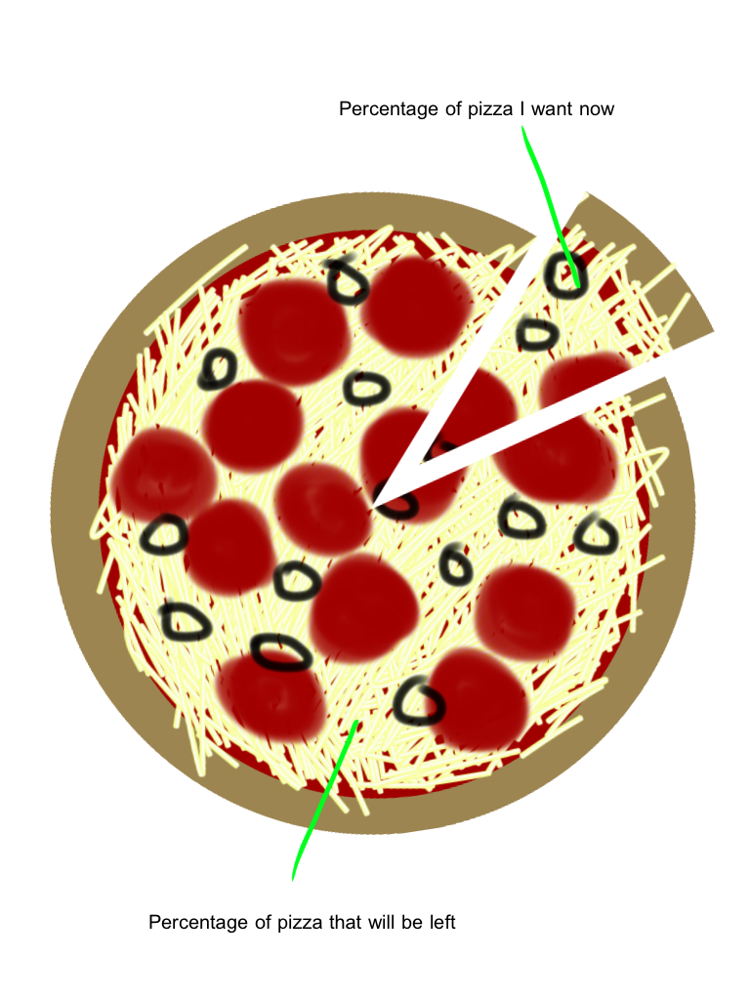
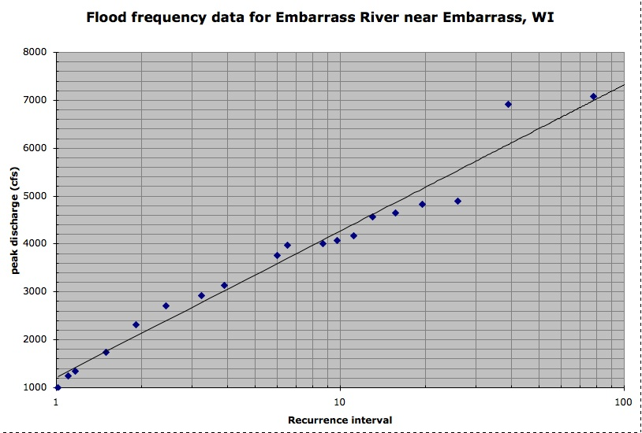
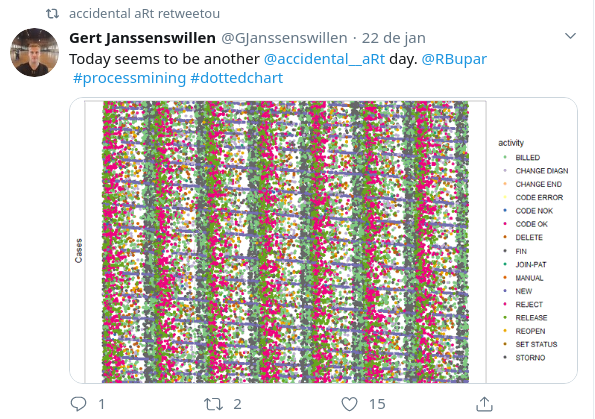

```{r, include=FALSE, message=FALSE}
options(tinytex.verbose = TRUE)
#library(GGally)
```
## sobre a aula 

1. noções básicas de gráficos

2. editando gráficos básicos no R

3. perfumaria


# 1. noções básicas de gráficos


## como \alert{[NÃO]} fazer

```{r setup, message=FALSE, echo=FALSE}
library(latticeExtra)
library(ggplot2)
library(wesanderson)
library(RColorBrewer)
library(wesanderson)
library(plotrix)
```

```{r bad-graphics, echo=FALSE, fig.width=4, fig.height=4, fig.align='center'}
d <- read.table(text = ' x   y     z
t1   5   high
t1   2   low
t1   4   med
t2   8   high
t2   1   low
t2   3   med
t3  50   high
t3  12   med
t3  35   low', header = TRUE)

levels(d$z) <- c("high", "med", "low")

cloud(y ~ x + z, d, 
      panel.3d.cloud = panel.3dbars, 
      col.facet = d$z, 
      xbase = 0.4, 
      ybase = 0.4, 
      scales = list(arrows = FALSE, col = 1), 
      par.settings = list(axis.line = list(col = "transparent")),
      main = "meu gráfico 3D")
```

## não mesmo

\begin{center}
\includegraphics{figs/facepalm.jpg}
\end{center}


## como fazer melhor


```{r palette, message=FALSE, echo=FALSE}
#names(wes_palettes)
##  [1] "BottleRocket1"  "BottleRocket2"  "Rushmore1"      "Royal1"        
##  [5] "Royal2"         "Zissou1"        "Darjeeling1"    "Darjeeling2"   
##  [9] "Chevalier1"     "FantasticFox1"  "Moonrise1"      "Moonrise2"     
## [13] "Moonrise3"      "Cavalcanti1"    "GrandBudapest1" "GrandBudapest2"
pal <- wes_palette(3, name = "Zissou1", type = "continuous")
```


```{r ggbarplot, echo=FALSE, fig.width=4.5, fig.height=3}
p <- ggplot(data = d, aes(x = x, y = y, fill = z)) +
  geom_bar(stat = "identity") +
  scale_fill_manual(values = pal[3:1]) +
  theme_classic()
p
```


## como \alert{[NUNCA]} fazer

```{r pie3d, echo=FALSE, fig.width=4.5, fig.height=4}
slices <- c(10, 12, 4, 16, 8) 
lbls <- c("US", "UK", "Australia", "Germany", "France")
pct <- round(slices/sum(slices) * 100)
lbls <- paste(lbls, pct) # add percents to labels 
lbls <- paste(lbls,"%",sep = "") # ad % to labels 
pie3D(slices, labels = lbls, explode = 0.1,
   main = "Pie Chart of Countries")
```

## #nunca

\begin{center}
\includegraphics{figs/elenunca.png}
\end{center}


## como \alert{[NÃO]} fazer

```{r pie, echo=FALSE, fig.width=4.5, fig.height=4}
pie(slices,labels = lbls, col = rainbow(length(lbls)),
   main = "Pie Chart of Countries")
```

## único gráfico de pizza possível

{width=250}


## como (tentar) fazer melhor 

```{r barplot, echo=FALSE}
nomes <- c("US", "UK", "Australia", "Germany", "France")
names(pct) <- nomes
perc <- paste0(pct, "%")
par(mai = c(1, 1, 1, 1))
barplot(pct, horiz = TRUE, las = 1, xlim = c(0, max(pct) + 3))
text(x = pct + 1.1,
     y = c(0.7, 1.9, 3.1, 4.3, 5.5),
     labels = perc)
```


## como fazer melhor 

```{r barplot2, echo=FALSE}
nomes <- c("US", "UK", "Australia", "Germany", "France")
perc <- paste0(sort(pct), "%")
names(pct) <- nomes
par(mai = c(1, 1, 1, 1))
barplot(sort(pct), horiz = TRUE, las = 1, xlim = c(0, max(pct) + 3))
text(x = sort(pct) + 1.1,
     y = c(0.7, 1.9, 3.1, 4.3, 5.5),
     labels = perc)
```


## mas sempre pode gráfico de barras?

```{r erro, echo=FALSE}
# create dummy data
set.seed(42)
d2 <- data.frame(name = letters[1:5],
                 value = sample(seq(4, 15), 5),
                 sd = c(1, 0.2, 3, 2, 4))

barplot(value ~ name, data = d2, las = 1, bty = 'l')
```

## um gráfico de barras com medida de erro é \alert{melhor}

```{r erro2, echo=FALSE}
barplot(value ~ name, data = d2, las = 1, 
        bty = 'l', ylim = c(0, 18))
arrows(x0 = c(0.66, 1.88, 3.07, 4.25, 5.48),
       y0 = d2$value + d2$sd,
       y1 = d2$value - d2$sd, angle = 90, length = 0.1, code = 3)
```

## melhor ainda é economizar tinta

```{r, echo=FALSE}
plot(x = 1:5, d2$value, las = 1, bty = 'l', ylim = c(0, 18), 
     pch = 19, xaxt = 'n',
     xlab = "names", ylab = "value")
axis(1, at = 1:5, labels = d2$name)
arrows(x0 = 1:5,
       y0 = d2$value + d2$sd,
       y1 = d2$value - d2$sd, 
       angle = 90, length = 0.05, code = 3)

```

## mas também a tinta tem que valer a pena

```{r, echo=FALSE, fig.width=4, fig.height=4, fig.align='center'}
d3 <- data.frame(media = c(6.7, 12.3),
                 sd = c(0.4, 0.98),
                 tratamento = c(1, 2))
plot(media ~ c(1,2), data = d3, las = 1, bty = 'l',
     xlab = "tratamento", pch = 19, xaxt = 'n', 
     ylim = c(2, 15))
axis(1, at = 1:2, labels = c("1", "2"))
arrows(x0 = 1:2,
       y0 = d3$media + d3$sd,
       y1 = d3$media - d3$sd, 
       angle = 90, length = 0.05, code = 3)
```

## uma tabela? 

|Tratamento|Efeito|
-----------|--------|
1 |`r d3$media[1]` $\pm$ `r d3$sd[1]` | 
2 |`r d3$media[2]` $\pm$ `r d3$sd[2]` | 


## no corpo do texto

\Large O efeito do tratamento 2 (12.3 $\pm$ 0.98) foi maior do que o tratamento 1 (6.7 $\pm$ 0.4).


## um diagrama de pontos

```{r echo=FALSE, fig.height=8.5}
require(graphics)
dotchart(log(islands, 10), 
         xlab = "log10(area) (log10(sq. miles)", 
         cex.lab = 0.9)
```

## um diagrama de pontos \alert{melhor}

```{r echo=FALSE,  fig.height=8.5}
dotchart(log(islands[order(islands)], 10),
          xlab = "log10(area) (log10(sq. miles)", 
         cex.lab = 0.9)
  
```

## como \alert{[NÃO]} fazer

```{r, echo=FALSE, fig.width=4, fig.height=4, fig.align='center'}
data(trees)
plot(log(Volume) ~ log(Girth), data = trees,
     pch = 15, col = "black", cex = 2,
     xlab = "log(Diameter)")
abline(lm(log(Volume) ~ log(Girth), data = trees))
```

## como fazer \alert{melhor} 

```{r, echo=FALSE, fig.width=4, fig.height=4, fig.align='center'}
plot(log(Volume) ~ log(Girth), data = trees,
     pch = 1, col = "black", cex = 1,
     xlab = "log(Diameter)", las = 1)
abline(lm(log(Volume) ~ log(Girth), data = trees))
```

## como fazer \alert{melhor} de outro jeito

```{r, echo=FALSE, fig.width=4, fig.height=4, fig.align='center'}
mycol <- rgb(1, 68, 33, maxColorValue = 255, alpha = 125)
plot(log(Volume) ~ log(Girth), data = trees,
     pch = 19, cex = 1,
     xlab = "log(Diameter)", las = 1,
     col = mycol, bty = "l")
abline(lm(log(Volume) ~ log(Girth), data = trees))
```


## boas práticas na construção de gráficos

\begin{enumerate}

\pause \item só apresentar um gráfico quando necessário
\pause \item não enganar o(a) leitor(a)
\pause \item moderar na quantidade de cores e de tinta
\pause \item sempre que possível apresentar medida de erro
\pause \item ordem dos elementos importa
\pause \item \texttt{las = 1} importa muito mais

\end{enumerate}

# 2. editando gráficos no R

## gráfico de barras

\footnotesize
```{r }
#perfil dos alunxs da disciplina
nivel <- c("iniciante", "intermediário", "experiente")
perc <- c(73.3, 20, 6.7)
alunxs <- data.frame(nivel, perc)
alunxs
```

## gráfico de barras padrão

```{r}
barplot(perc ~ nivel, data = alunxs)
```

## como mudar a ordem das barras?

\footnotesize
```{r }
alunxs$nivel <- factor(alunxs$nivel,
                       levels = c("iniciante",
                                  "intermediário",
                                  "experiente"))
alunxs$nivel
```

## gráfico de barras ordenado

\footnotesize
```{r }
# agora vamos refazer o gráfico
barplot(perc ~ nivel, data = alunxs)
```

## deixando o rótulo do eixo y na vertical

```{r, fig.show='hide'}
# las=1
barplot(perc ~ nivel, data = alunxs, las = 1)
```


## deixando o rótulo do eixo y na vertical

```{r, echo=FALSE}
# las=1
barplot(perc ~ nivel, data = alunxs, las = 1)
```


## mudando o rótulo dos eixos

```{r, fig.show='hide' }
# usando xlab e ylab
barplot(perc ~ nivel, data = alunxs, 
        las = 1, 
        xlab = "Nível de conhecimento em R", 
        ylab = "Porcentagem (%) de alunxs")
```

## mudando o rótulo dos eixos

```{r, echo=FALSE}
# usando xlab e ylab
barplot(perc ~ nivel, data = alunxs, 
        las = 1, 
        xlab = "Nível de conhecimento em R", 
        ylab = "Porcentagem (%) de alunxs")
```


## incluindo cor

```{r, fig.show='hide'}
# argumento col
barplot(perc ~ nivel, data = alunxs, 
        las = 1, 
        xlab = "Nível de conhecimento em R",
        ylab = "Porcentagem (%) de alunxs",
        col = 1)
```


## incluindo cor


```{r, echo=FALSE}
# argumento col
barplot(perc ~ nivel, data = alunxs,
        las = 1,
        xlab = "Nível de conhecimento em R",
        ylab = "Porcentagem (%) de alunxs",
        col = 1)
```


## incluindo cor pelo nome


```{r, fig.show='hide'}
# argumento col
barplot(perc ~ nivel, data = alunxs, 
        las = 1, 
        xlab = "Nível de conhecimento em R", 
        ylab = "Porcentagem (%) de alunxs", 
        col = 'black')
```

## incluindo cor pelo nome


```{r, echo=FALSE}
# argumento col
barplot(perc ~ nivel, data = alunxs, 
        las = 1, 
        xlab = "Nível de conhecimento em R", 
        ylab = "Porcentagem (%) de alunxs", 
        col = 'black')
```

## incluindo cor pelo código hexadecimal

```{r, fig.show='hide'}
# argumento col
barplot(perc ~ nivel, data = alunxs, 
        las = 1, 
        xlab = "Nível de conhecimento em R",
        ylab = "Porcentagem (%) de alunxs",
        col = "#000000")
```


## incluindo cor pelo código hexadecimal

```{r, echo=FALSE}
# argumento col
barplot(perc ~ nivel, data = alunxs,
        las = 1, 
        xlab = "Nível de conhecimento em R",
        ylab = "Porcentagem (%) de alunxs",
        col = "#000000")
```

## incluindo cor pelo código RGB

```{r, fig.show='hide'}
# funcao rgb
barplot(perc ~ nivel, data = alunxs,
        las = 1, 
        xlab = "Nível de conhecimento em R",
        ylab = "Porcentagem (%) de alunxs",
        col = rgb(0, 0, 0, maxColorValue = 255))
```

## incluindo cor pelo código RGB

\footnotesize
```{r, echo=FALSE}
# 
barplot(perc ~ nivel, data = alunxs,
        las = 1,
        xlab = "Nível de conhecimento em R",
        ylab = "Porcentagem (%) de alunxs",
        col = rgb(0, 0, 0, maxColorValue = 255))
```

## precisa de cor?

```{r, echo=FALSE}
# uma barra de cada cor
barplot(perc ~ nivel, data = alunxs,
        las = 1,
        xlab = "Nível de conhecimento em R",
        ylab = "Porcentagem (%) de alunxs",
        col = c("red", "blue", "green"))
```

## precisa de cor?

```{r, echo=FALSE}
# voltando ao padrão de cores original
barplot(perc ~ nivel, data = alunxs,
        las = 1,
        xlab = "Nível de conhecimento em R",
        ylab = "Porcentagem (%) de alunxs")
```

## gráfico de barras com subcategorias

\footnotesize
```{r, fig.show='hide'}
d.Titanic <- as.data.frame(Titanic)
head(d.Titanic)
barplot(Freq ~ Class + Survived, data = d.Titanic,
        subset = Age == "Adult" & Sex == "Male",
        ylab = "N of Passengers", legend = TRUE)
```

## gráfico de barras com subcategorias

```{r, echo=FALSE}
#par(mfrow = 2:1, mgp = c(3,1,0)/2, mar = .1+c(3,3:1))
d.Titanic <- as.data.frame(Titanic)
barplot(Freq ~ Class + Survived, data = d.Titanic,
        subset = Age == "Adult" & Sex == "Male",
        ylab = "N of Passengers",
        legend = TRUE)
```

## gráfico de barras em "mosaico"

```{r, fig.show='hide'}
# Corresponding table :
xt <- xtabs(Freq ~ Survived + Class + Sex,
            d.Titanic,
            subset = Age == "Adult")
# Alternatively, a mosaic plot:
mosaicplot(xt[, , "Male"], main = "", color = TRUE)
```


## gráfico de barras em "mosaico"

```{r, echo=FALSE}
# Corresponding table :
xt <- xtabs(Freq ~ Survived + Class + Sex, d.Titanic, 
            subset = Age == "Adult")
# Alternatively, a mosaic plot :
mosaicplot(xt[, , "Male"], main = "", color = TRUE)
```

## gráfico de dispersão

\footnotesize
```{r, fig.show='hide'}
m1 <- lm(log(dist) ~ log(speed), data = cars)
plot(log(dist) ~ log(speed), data = cars,
     las = 1, bty = 'l', pch = 19)
abline(m1)
```

## gráfico de dispersão

```{r, echo=FALSE, fig.height=4, fig.width=4}
plot(log(dist) ~ log(speed), data = cars,
     las = 1, bty = 'l', pch = 19)
abline(m1)
```

## gráfico de dispersão com cor transparente

```{r, echo=FALSE, fig.height=4, fig.width=4, fig.show='hide'}
mycol <- rgb(0, 0, 0, maxColorValue = 255, alpha = 125)
m1 <- lm(log(dist) ~ log(speed), data = cars)
plot(log(dist) ~ log(speed), data = cars,
     las = 1, bty = 'l', pch = 19, 
     col = mycol)
abline(m1)
```


## gráfico de dispersão com cor transparente

```{r, echo=FALSE, fig.height=4, fig.width=4}
mycol <- rgb(0, 0, 0, maxColorValue = 255, alpha = 125)
m1 <- lm(log(dist) ~ log(speed), data = cars)
plot(log(dist) ~ log(speed), data = cars,
     las = 1, bty = 'l', pch = 19, 
     col = mycol)
abline(m1)
```

## adicionando uma imagem ao gráfico

```{r, fig.show="hide"}
library(png)
library(grid)
pic <- readPNG("figs/car.png")
plot(log(dist) ~ log(speed), data = cars,
     las = 1, bty = 'l', pch = 19, 
     col = mycol)
abline(m1)
grid.raster(pic, .25, .83, width = .2)

```


## adicionando uma imagem ao gráfico

```{r, echo=FALSE, fig.height=4, fig.width=4}
plot(log(dist) ~ log(speed), data = cars,
     las = 1, bty = 'l', pch = 19, 
     col = mycol)
abline(m1)
grid.raster(pic, .31, .73, width = .15) 

```

## gráficos com múltiplas janelas

\footnotesize

```{r, eval = F, fig.show=FALSE}
x <- log(cars$speed); y <- log(cars$dist)
zones <- matrix(c(2, 0, 1, 3), ncol = 2, byrow = TRUE)
layout(zones, widths = c(4/5, 1/5), heights = c(1/5, 4/5))
xhist <- hist(x, plot = FALSE); yhist <- hist(y, plot = FALSE)
top <- max(c(xhist$counts, yhist$counts))
plot(x, y, las = 1, xlab = "log(speed)", 
     ylab = "log(dist)", col = mycol, bty = 'l', pch = 19)
abline(m1)
grid.raster(pic, .16, .63, width = .15)
par(mar = c(0, 3, 1, 1))
barplot(xhist$counts, axes = FALSE, ylim = c(0, top), 
        space = 0, col = mycol)
par(mar = c(3, 0, 1, 1))
barplot(yhist$counts, axes = FALSE, xlim = c(0, top), 
        space = 0, horiz = TRUE, col = mycol)

```


## gráficos com múltiplas janelas


```{r, echo = FALSE}
x <- log(cars$speed)
y <- log(cars$dist)
zones <- matrix(c(2, 0, 1, 3), ncol = 2, byrow = TRUE)
layout(zones, widths = c(4 / 5, 1 / 5), heights = c(1 / 5, 4 / 5))
xhist <- hist(x, plot = FALSE)
yhist <- hist(y, plot = FALSE)
top <- max(c(xhist$counts, yhist$counts))
plot(x, y, las = 1, xlab = "log(speed)", ylab = "log(dist)", 
     col = mycol, bty = 'l', pch = 19)
abline(m1)
grid.raster(pic, .16, .63, width = .15)
par(mar = c(0, 3, 1, 1))
barplot(xhist$counts, axes = FALSE, ylim = c(0, top), 
        space = 0, col = mycol)
par(mar = c(3, 0, 1, 1))
barplot(yhist$counts, axes = FALSE, xlim = c(0, top), 
        space = 0, horiz = TRUE, col = mycol)
#par(oma=c(3,3,0,0))
#mtext("log(speed)", 1,outer=FALSE)
#mtext("log(dist)", 2,outer=TRUE)
```

## séries temporais

\scriptsize
```{r }
data(longley)
head(longley)[, 1:5]
```

## séries temporais

\scriptsize
```{r, fig.width=3.7, fig.height=3.7, fig.align='center' }
barplot(GNP ~ Year, data = longley)
```

## séries temporais de outra forma

\scriptsize
```{r, fig.width=3.7, fig.height=3.7, fig.align='center' }
plot(GNP ~ Year, data = longley, type = 'l',
     xaxt = 'n', las = 1, bty = 'l', lty = 2, lwd = 2)
axis(1, at = longley$Year)
```


## séries temporais de uma \alert{melhor} forma

\scriptsize
```{r, fig.width=3.7, fig.height=3.7, fig.align='center'  }
plot(GNP ~ Year, data = longley, type = 'l', 
     xaxt = 'n', las = 1, bty = 'l', lty = 1, lwd = 2)
axis(1, at = longley$Year)
```

# 3. perfumaria

## recursos para apresentações

- paletas de cores:
  - [Color Brewer](http://colorbrewer2.org/)
  - [Adobe Color ](https://color.adobe.com/create)
  - [COLOR lovers](https://www.colourlovers.com/)
  
- ícones para adicionar em gráficos:
  - [The noun project](https://thenounproject.com/)
  - [iconmonst](https://iconmonstr.com/)

- pacotes de R:
  - `wesanderson`
  - `RColorBrewer`
  - `swatches`
  - `colourlovers`

## temos que falar de:

- `ggplot2`
- [`gganimate`](https://gganimate.com/)

## por favor não vamos voltar no tempo

{width=300}


## por favor não vamos voltar no tempo

{width=350}

## @accidental_aRt

{width=350}

## Danielle Navarro <3 https://djnavarro.net/art/

{width=400}

