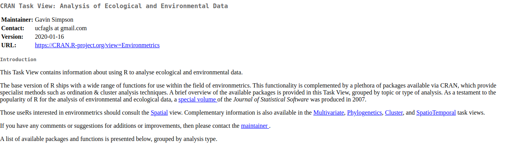

```{r setup, include=FALSE}
options(htmltools.dir.version = FALSE, echo = F)
```

```{r xaringan-themer, include = FALSE}
library(xaringanthemer)
duo_accent(
  primary_color = "#A70000",
  secondary_color = "#ff0000",
  white_color = "white",
  
  header_font_google = google_font("Roboto Condensed"),
  text_font_google   = google_font("Roboto Condensed", "300", "300i"),
  code_font_google   = google_font("Ubuntu Mono"), text_font_size = "30px"
)
```

## esta semana

+ conceitos de ciência aberta
+ estrutura de um projeto de análise de dados
+ controle de versões usando git/GitHub
+ formatação de planilhas
+ análise exploratória de dados
+ relatórios reproduzíveis 

### como levar isso para meu fluxo de trabalho?
### como aprender mais sobre R __e estatística__ em geral?

---
## fazendo as análises que me interessam - como começar?

+ não foque apenas nas ferramentas
+ hipótese(s) embasadas na teoria
+ estudando - R não resolve nada por si só

--
### É uma pergunta de teoria em minha área ou de R?

---
## R ou teoria? 

+ em algumas áreas __R é a ferramenta para aprender a teoria__
  + Ben Bolker: [Ecological Models and Data in R](http://emdbolker.wikidot.com/)
  + Daniel Borcard et al. [Numerical Ecology with R]()
  + Richard McElreath: [Statistical Rethinking]()
  + Emmanuel Paradis: [Analysis of phylogenetics and evolution with R]()
  + Mark Vellend: [The theory of ecological communities]()
  + Hadley Wickham: [R for Data Science]()

---
## estatística

+ Danielle Navarro: [Learning Statistics with R](https://learningstatisticswithr.com)
+ Michael Crawley: [The R book]()

---
## onde continuar aprendendo

+ disciplinas de R
+ Coursera 
+ tutoriais online
+ meetups (reuniões) de grupos: RLadies
+ o help dos pacotes: vegan: a própria página do Jari Oksanen

---
## buscar ajuda

+ Google
+ Listas de emails específicas (GIS, phylogenetics, etc…)
+ Os autores do pacote ou os repositórios de github 
+ Research Gate
+ Stack Overflow: leia bem as instruções para postar perguntas e tente dar exemplos
+ twitter

---
## reference card

```{r, fig.width = 10, fig.align = 'center', echo=F}
knitr::include_graphics("figs/ref_card.png")
```

---
## cheat sheets 

```{r, fig.width = 10, fig.align = 'center', echo = F}
knitr::include_graphics("figs/cheet_sheet.png")
```

---
## R Task views

Alguns pacotes organizados por temas, curados por um especialista
 
+ [https://cran.r-project.org/web/views/](https://cran.r-project.org/web/views/)
+ [https://cran.r-project.org/web/views/Multivariate.html](https://cran.r-project.org/web/views/Multivariate.html)
+ [https://cran.r-project.org/web/views/Phylogenetics.html](https://cran.r-project.org/web/views/Phylogenetics.html)

---
## task view: environmetrics

```{r ,echo=FALSE}

```

# trabalho final 
---

## objetivo

+ escolher __um projeto pessoal__
+ definir a estrutura de pastas
+ definir um objetivo, hipóteses, resultados esperados, explicar no readme
+ criar um projeto de análise de dados com a estrutura definida
+ criar um relatório reproduzível em rmarkdown que possa ser knittado
+ configurar git e fazer push do relatório para um repositório web


